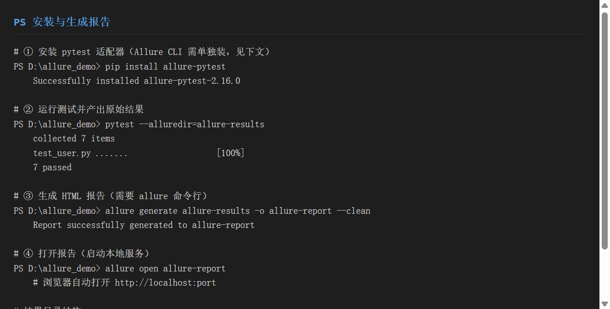
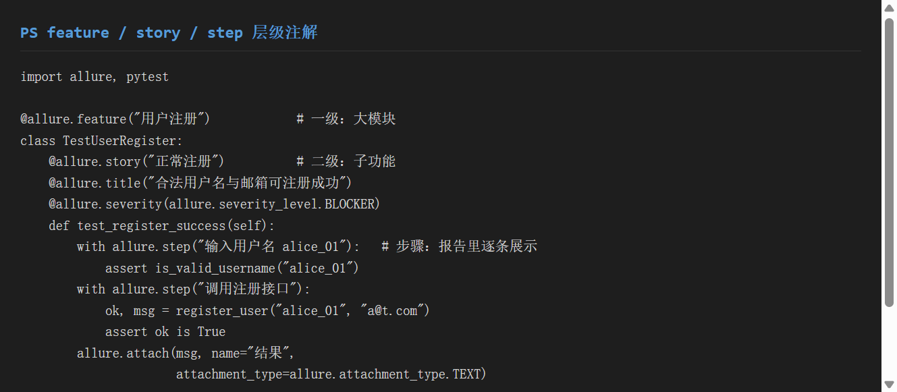
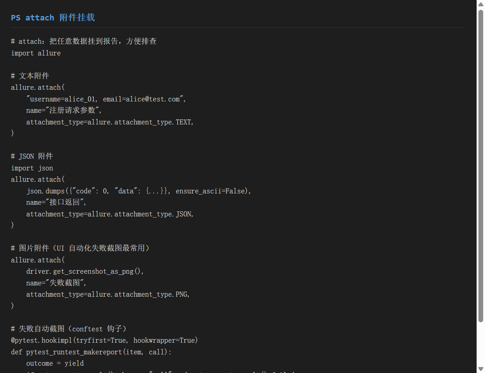
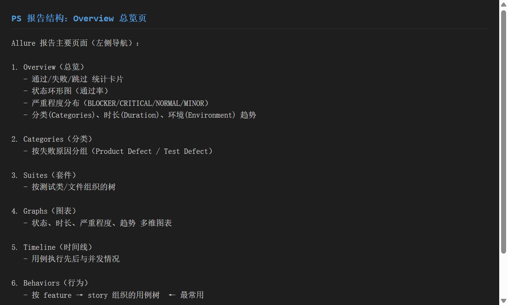
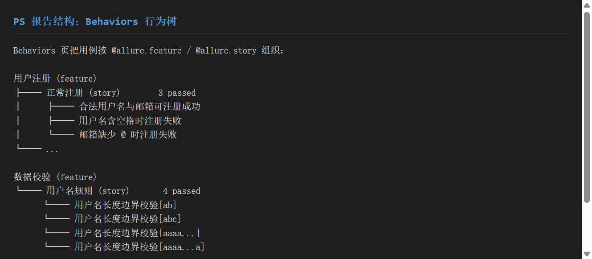
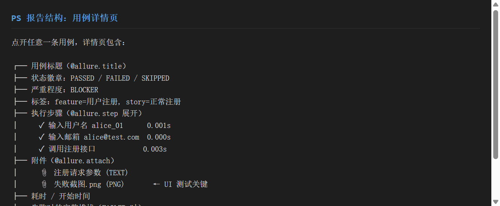
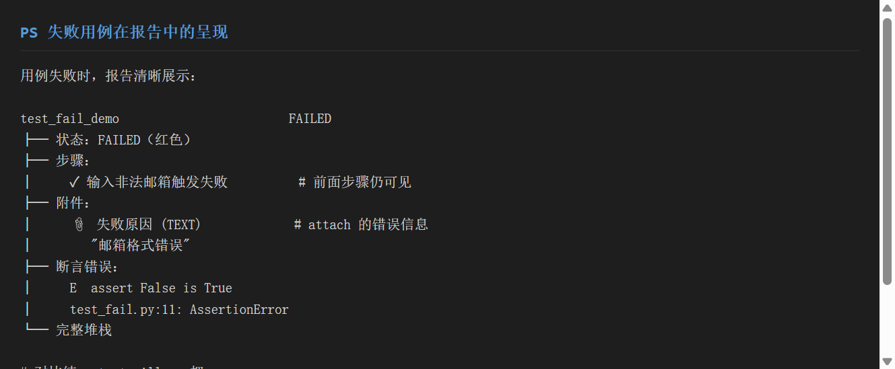

# 《Allure 测试报告》使用分享

> 工具：**Allure**（测试报告框架）+ **allure-pytest**（pytest 适配器）
> 适用系统：Windows / macOS / Linux
> 目标：一份文档教会你**装配 Allure、用 feature/story/step 组织用例、用 attach 挂载现场数据、读懂报告结构**——让测试报告从"一堆日志"变成"可读的质检报告"

---

## 一、环境准备

### 1.1 安装两部分

Allure 由**两个独立部分**组成，缺一不可：

| 部分 | 作用 | 安装方式 |
|------|------|---------|
| `allure-pytest` | pytest 适配器，跑测试时**产出原始结果 JSON** | `pip install allure-pytest` |
| `allure` 命令行 | 把 JSON **生成 HTML 报告** | 系统级安装（Scoop / Homebrew / 下载二进制） |

```bash
# ① Python 侧：适配器
pip install allure-pytest
# Successfully installed allure-pytest-2.16.0

# ② 系统侧：命令行（以 Windows Scoop 为例）
scoop install allure
# 或 macOS：
brew install allure
# 或手动：https://github.com/allure-framework/allure2/releases

# 验证
allure --version
# 2.15.0
```

> **易错点**：只装 `allure-pytest` 只能产出 `allure-results/`，**没有命令行就无法生成 `allure-report/`**。两者都要装。

### 1.2 生成报告的两条命令

```bash
# 第 1 步：跑测试，产出原始结果（JSON）
pytest --alluredir=allure-results

# 第 2 步：生成 HTML 报告
allure generate allure-results -o allure-report --clean

# 打开报告（启动本地 Web 服务）
allure open allure-report
```


> ▲ 截图标注：红框标出 `allure generate ... successfully generated` 成功提示，以及 `allure-results/`（原始数据）与 `allure-report/`（HTML 报告）两个目录的区别。

### 1.3 目录关系

```text
项目/
├── test_user.py          测试代码（含 @allure 注解）
├── allure-results/       ← pytest 产出，一堆 .json（给 CI 用）
└── allure-report/        ← allure generate 产出，HTML（给人看）
```

> 提交 CI 时通常只保留 `allure-results/`，报告由流水线统一生成。

---

## 二、核心功能演示

### 2.1 功能一：feature / story / step 三级注解

这是 Allure 最核心价值——把扁平的测试用例**组织成有业务含义的层级树**。

**层级关系**：`feature`（模块）→ `story`（功能）→ `test`（用例）→ `step`（步骤）

```python
import allure
import pytest
from user import register_user, is_valid_username

@allure.feature("用户注册")                 # 一级：大业务模块
class TestUserRegister:
    @allure.story("正常注册")               # 二级：子功能
    @allure.title("合法用户名与邮箱可注册成功")   # 用例标题（报告里显示）
    @allure.severity(allure.severity_level.BLOCKER)  # 严重程度
    def test_register_success(self):
        with allure.step("输入用户名 alice_01"):    # 步骤：报告逐条展示
            assert is_valid_username("alice_01")
        with allure.step("调用注册接口"):
            ok, msg = register_user("alice_01", "a@t.com")
            assert ok is True
```

**常用注解速查**：

| 注解 | 作用 |
|------|------|
| `@allure.feature("X")` | 一级分类（模块） |
| `@allure.story("Y")` | 二级分类（功能） |
| `@allure.title("Z")` | 用例标题（替代函数名展示） |
| `@allure.severity(LEVEL)` | 严重程度：BLOCKER/CRITICAL/NORMAL/MINOR |
| `@allure.step("描述")` | 步骤（with 语法包裹代码块） |
| `@allure.description("...")` | 用例详细描述 |
| `@allure.link(url, name)` | 关联需求/缺陷链接 |


> ▲ 截图标注：红框标出 `@allure.feature`（模块）、`@allure.story`（功能）、`with allure.step(...)`（步骤）三级结构，以及 `@allure.severity` 严重程度。

### 2.2 功能二：attach 附件挂载

`allure.attach` 把**任意现场数据**挂到报告上，失败排查时无需翻日志。

**三种常用类型**：

```python
import allure, json

# ① 文本附件（请求参数、中间结果）
allure.attach(
    "username=alice_01, email=alice@test.com",
    name="注册请求参数",
    attachment_type=allure.attachment_type.TEXT,
)

# ② JSON 附件（接口返回）
allure.attach(
    json.dumps({"code": 0, "data": {}}, ensure_ascii=False),
    name="接口返回",
    attachment_type=allure.attachment_type.JSON,
)

# ③ 图片附件（UI 自动化失败截图，最常用）
allure.attach(
    driver.get_screenshot_as_png(),
    name="失败截图",
    attachment_type=allure.attachment_type.PNG,
)
```

**实战：失败自动截图（conftest.py 钩子）**

```python
import allure
import pytest

@pytest.hookimpl(tryfirst=True, hookwrapper=True)
def pytest_runtest_makereport(item, call):
    outcome = yield
    report = outcome.get_result()
    # 用例执行阶段（call）且失败时才截图
    if report.when == "call" and report.failed:
        driver = item.funcargs.get("driver")
        if driver:
            allure.attach(
                driver.get_screenshot_as_png(),
                name="失败截图",
                attachment_type=allure.attachment_type.PNG,
            )
```


> ▲ 截图标注：红框标出 `allure.attach` 的 TEXT / JSON / PNG 三种 `attachment_type`，以及 `conftest.py` 中失败自动截图的钩子结构。

### 2.3 完整示例测试代码

```python
# test_user.py
import allure
import pytest
from user import register_user, is_valid_username

@allure.feature("用户注册")
class TestUserRegister:
    @allure.story("正常注册")
    @allure.title("合法用户名与邮箱可注册成功")
    @allure.severity(allure.severity_level.BLOCKER)
    def test_register_success(self):
        with allure.step("输入用户名 alice_01"):
            assert is_valid_username("alice_01")
        with allure.step("调用注册接口"):
            ok, msg = register_user("alice_01", "a@t.com")
            assert ok is True
            assert msg == "注册成功"
        allure.attach(
            "username=alice_01, email=a@t.com",
            name="注册请求参数",
            attachment_type=allure.attachment_type.TEXT,
        )

    @allure.story("非法用户名")
    @allure.title("用户名含空格时注册失败")
    @allure.severity(allure.severity_level.CRITICAL)
    def test_register_bad_username(self):
        with allure.step("输入非法用户名 'alice 01'"):
            ok, msg = register_user("alice 01", "a@t.com")
        with allure.step("断言返回失败原因"):
            assert ok is False
            assert msg == "用户名格式错误"
        allure.attach(msg, name="错误原因",
                      attachment_type=allure.attachment_type.TEXT)
```

运行：

```bash
pytest test_user.py --alluredir=allure-results
# collected 7 items
# test_user.py .......              [100%]
# 7 passed

allure generate allure-results -o allure-report --clean
# Report successfully generated to allure-report
```

---

## 三、实战示例

### 3.1 项目背景

为"用户注册"模块写测试，要求：
- 用 feature/story 体现**业务层级**（注册模块 → 正常/异常场景）
- 每步用 step 拆解，失败时知道卡在哪
- 用 attach 把**请求参数**挂到报告，方便复查
- 产出可读的 HTML 报告给产品和开发看

### 3.2 操作流程

```bash
# ① 建虚拟环境并安装
python -m venv .venv && source .venv/Scripts/activate
pip install pytest allure-pytest

# ② 写业务代码 user.py + 测试 test_user.py（含 allure 注解）

# ③ 产出结果
pytest --alluredir=allure-results

# ④ 生成并打开报告
allure generate allure-results -o allure-report --clean
allure open allure-report
```

### 3.3 结果

- 终端：`7 passed`
- `allure-results/`：15 个 JSON（含 1 个 `.txt` 附件）
- `allure-report/`：可分享的 HTML 报告
- 报告 Behaviors 页呈现：
  - **用户注册**（feature）：3 条用例（正常/非法用户名/非法邮箱）
  - **数据校验**（feature）：4 条参数化用例（用户名长度边界）

> 各步骤截图对应：①安装生成（step01）、feature/story/step（step02）、attach（step03）、报告结构（step04~07）。

---

## 四、报告结构解读

Allure 报告左侧有 7 个页面，下面逐页说明**看什么、怎么用**。

### 4.1 Overview（总览页）


> ▲ 截图标注：红框标出总览页的 4 个核心区：统计卡片、状态环形图、严重程度分布、趋势图。

包含：
- **统计卡片**：通过 / 失败 / 跳过 / 总览数量
- **状态环形图**：通过率一目了然
- **严重程度分布**：BLOCKER/CRITICAL/NORMAL/MINOR 各自多少
- **趋势区**：历次运行的对比（需多次运行才有）

### 4.2 Categories（分类页）

按**失败原因**自动分组：
- **Product Defects**：被测系统的 bug（断言失败）
- **Test Defects**：测试代码自身问题（如元素定位失败）

> 快速区分"是产品坏了还是测试写错了"。

### 4.3 Suites（套件页）

按测试类 / 文件组织的树，适合从代码视角排查。

### 4.4 Graphs（图表页）

状态、时长、严重程度、趋势的**多维图表**，适合向领导汇报整体质量趋势。

### 4.5 Timeline（时间线页）

展示用例**执行的先后顺序与并发情况**，定位耗时瓶颈。

### 4.6 Behaviors（行为页）★ 最常用


> ▲ 截图标注：红框标出 `feature → story` 的树形结构，以及每个 story 后的通过数统计。

按 `@allure.feature` / `@allure.story` 组织的**业务树**：

```text
用户注册 (feature)
├── 正常注册 (story)          3 passed
│     ├── 合法用户名与邮箱可注册成功
│     ├── 用户名含空格时注册失败
│     └── 邮箱缺少 @ 时注册失败
数据校验 (feature)
└── 用户名规则 (story)         4 passed
      └── 用户名长度边界校验[ab]
      └── 用户名长度边界校验[abc]
      └── ...
```

> **价值**：产品/测试一眼看懂"测了哪些功能、哪些通过"。点 story 可筛选只看该子功能。

### 4.7 用例详情页 ★ 最关键


> ▲ 截图标注：红框标出详情页的「执行步骤区」（step 逐条）与「附件区」（attach 的 TEXT/PNG）。

点开任意用例，详情页聚合了所有排查信息：

```text
┌─ 用例标题（@allure.title）
├─ 状态徽章：PASSED / FAILED / SKIPPED
├─ 严重程度：BLOCKER
├─ 标签：feature=用户注册, story=正常注册
├─ 执行步骤（@allure.step 展开）
│     ✓ 输入用户名 alice_01        0.001s
│     ✓ 调用注册接口              0.003s
├─ 附件（@allure.attach）
│     📎 注册请求参数 (TEXT)
│     📎 失败截图.png (PNG)
├─ 耗时 / 开始时间
└─ 失败时的完整堆栈（FAILED 时）
```

### 4.8 失败用例的呈现


> ▲ 截图标注：红框标出失败用例的「步骤轨迹」+「错误原因附件」+「断言堆栈」三者聚合。

失败时，Allure 把三类信息聚在同一页：
1. **step 执行轨迹**：前面通过的步骤仍可见，知道卡在哪一步
2. **attach 现场数据**：如 `失败原因: 邮箱格式错误`
3. **断言堆栈**：`E assert False is True` + 代码行号

> 对比纯 pytest 文本日志：Allure 让失败**自解释**，无需在日志里翻找上下文。

---

## 五、踩坑记录

### 5.1 装了 allure-pytest 却报 "allure: command not found"

**现象**：`pytest --alluredir` 能跑，但 `allure generate` 提示找不到命令。

**原因**：只装了 Python 适配器，没装系统级 `allure` 命令行。

**解决**：按 1.1 节装命令行（Scoop / Brew / 二进制），并确保 `allure` 在 PATH 中。

### 5.2 报告打开是空白页

**现象**：浏览器打开 `allure-report/index.html` 空白。

**原因**：Allure 报告用了 `fetch` 加载本地 JSON，**不能直接 `file://` 双击打开**（浏览器跨域限制）。

**解决**：
```bash
allure open allure-report     # 自动起本地服务，正解
# 或
python -m http.server -d allure-report 8080   # 手动起服务
```
> 切勿直接双击 `index.html`。

### 5.3 报告里没有 step / attach

**现象**：报告只显示用例名，没有步骤拆解和附件。

**原因**：`@allure.step` 和 `allure.attach` 写在**没被收集**的代码里，或 `allure-pytest` 版本与 pytest 不兼容。

**解决**：
- 确认 `import allure` 且装饰器/with 语法正确
- 升级到匹配版本：`pip install -U allure-pytest`
- step 必须用 `with allure.step("..."):` 包住真实执行代码

### 5.4 feature/story 没出现在 Behaviors 页

**现象**：Behaviors 页为空或只有用例名。

**原因**：注解写错位置——`@allure.feature` 应加在**类上**或**函数上**，`@allure.story` 同理。

**解决**：
```python
# 类级别
@allure.feature("用户注册")
class TestX:
    @allure.story("正常注册")
    def test_y(self): ...
```
> feature/story 也可加在测试函数上（不依赖类）。

### 5.5 attach 中文乱码

**现象**：报告里 TEXT 附件中文变乱码。

**原因**：`allure.attach` 的文本未指定编码，或源字符串编码不一致。

**解决**：
```python
# 传字符串时确保是 str（Python3 默认 utf-8 即可）
allure.attach(text, name="参数", attachment_type=allure.attachment_type.TEXT)
# JSON 附件显式 ensure_ascii=False
allure.attach(json.dumps(d, ensure_ascii=False), name="返回",
              attachment_type=allure.attachment_type.JSON)
```

### 5.6 CI 中报告不生成 / 超时

**现象**：流水线里 `allure generate` 卡住或报告缺失。

**原因**：`allure-results/` 被 `.gitignore` 误忽略，或生成命令路径不对。

**解决**：
- 确保 `allure-results/` 在 workspace 内且未被忽略
- 用绝对/相对一致路径：`allure generate ./allure-results -o ./allure-report`
- 大项目加 `--clean` 避免旧数据残留

---

## 六、总结

### 6.1 Allure 优缺点

| 优点 | 缺点 |
|------|------|
| 报告美观、层级清晰（feature/story） | 需装两个组件（适配器 + 命令行） |
| step + attach 让失败自解释 | 报告体积较大 |
| 严重程度/趋势多维分析 | 本地需起服务才能看 |
| 与 pytest/JUnit 等无缝集成 | CLI 版本偶尔与适配器不兼容 |

### 6.2 适用场景

| 场景 | 推荐做法 |
|------|---------|
| 接口/UI 自动化 | pytest + allure-pytest + 失败截图 attach |
| 向产品/领导汇报 | Overview + Graphs + Behaviors 页 |
| CI/CD 流水线 | 产出 `allure-results/`，由平台（如 Jenkins Allure Plugin）统一生成 |
| 轻量需求 | 可用 pytest-html（见前篇），重度分析用 Allure |

### 6.3 三句口诀

> 1. **两级注解组织用例**：`feature` 管模块、`story` 管功能
> 2. **step 拆步骤、attach 挂现场**：失败一眼看到卡在哪、现场数据是什么
> 3. **报告要起服务看**：`allure open`，别直接双击 `index.html`

### 6.4 速查表

```bash
# 安装
pip install allure-pytest          # 适配器
scoop install allure                # 命令行（Win）

# 产出 + 生成 + 打开
pytest --alluredir=allure-results
allure generate allure-results -o allure-report --clean
allure open allure-report

# 常用注解
@allure.feature("模块")             # 一级
@allure.story("功能")               # 二级
@allure.title("用例标题")
@allure.severity(allure.severity_level.BLOCKER)
with allure.step("步骤描述"): ...   # 步骤
allure.attach(data, name="x", attachment_type=allure.attachment_type.TEXT)
```

---

## 附：本分享对应的可运行示例

仓库（`allure_demo/`）包含：
- `user.py` — 被测试的用户注册逻辑
- `test_user.py` — feature/story/step/severity/attach/parametrize 示例
- `conftest.py` — 失败自动截图钩子（可参考前文）
- `allure-results/` — 运行产出的原始 JSON
- `allure-report/` — 生成的 HTML 报告

> 运行 `pytest --alluredir=allure-results && allure generate allure-results -o allure-report --clean && allure open allure-report` 即可复现本文全部示例。
