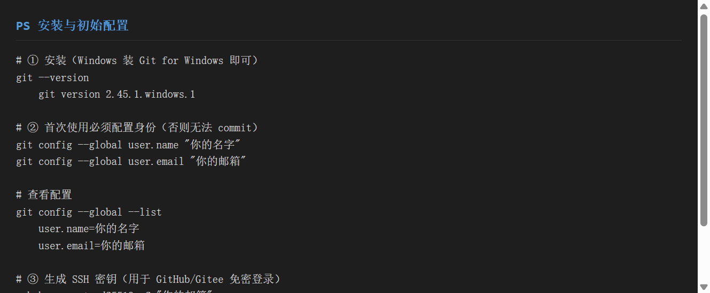
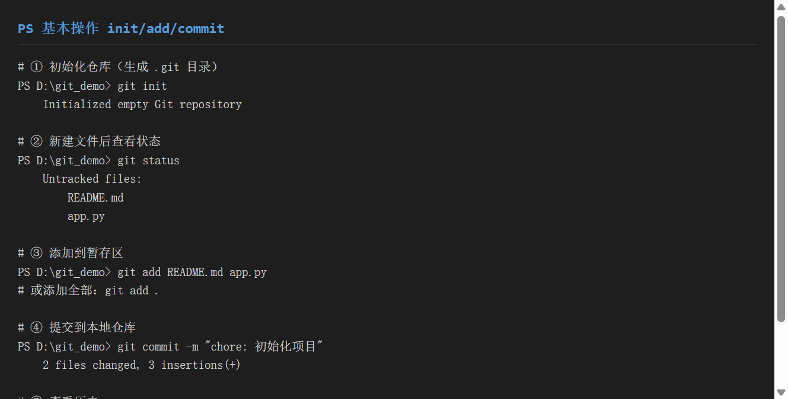
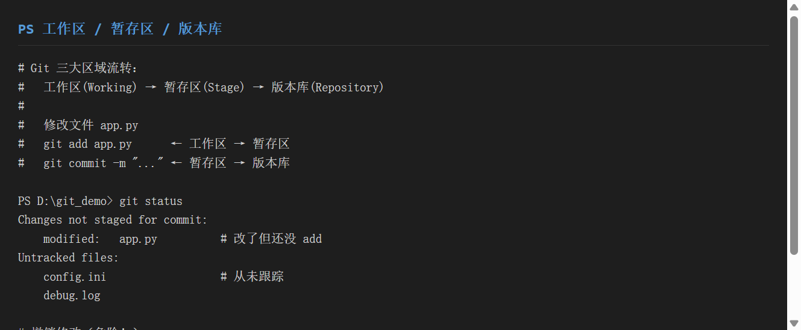
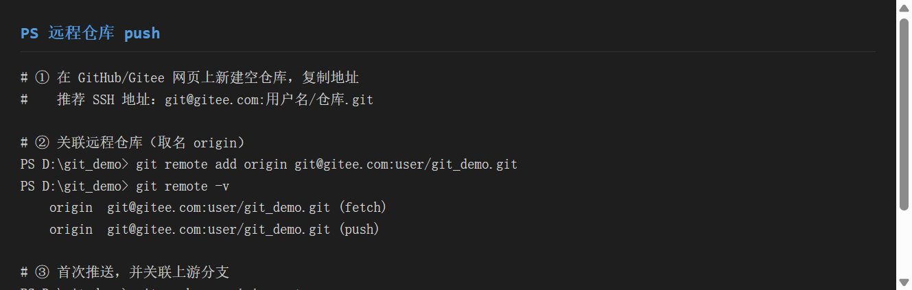
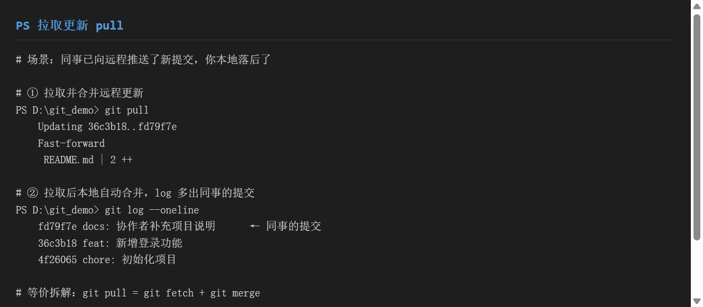
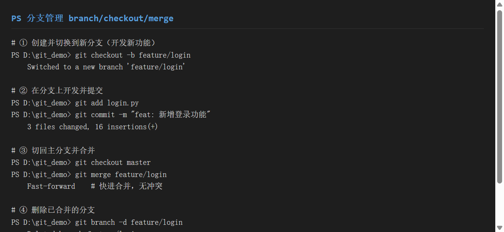
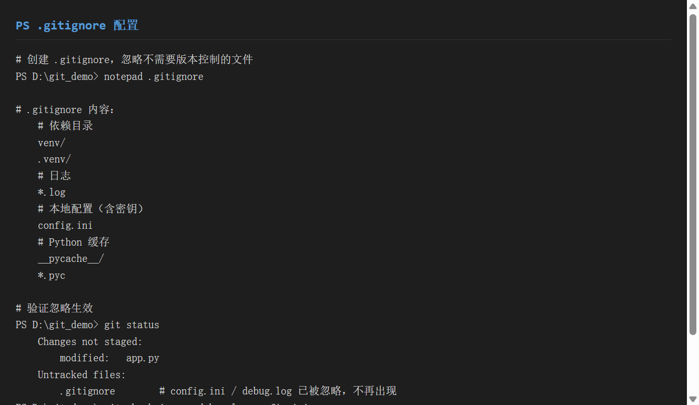

# 《Git 版本控制方法》使用分享

> 工具：**Git**（分布式版本控制器）+ **GitHub / Gitee**（远程托管平台）
> 适用系统：Windows / macOS / Linux
> 目标：一份文档教会你**环境安装、init/add/commit/push/pull 基本操作、分支管理、.gitignore 配置**——从"把文件传到 GitHub"到"多人协作不冲突"

---

## 一、环境准备

### 1.1 安装 Git

**Windows**：下载 [Git for Windows](https://git-scm.com/download/win)，安装时一路 Next 即可。自带 Git Bash（推荐）和 Git GUI。

```bash
# 验证安装
git --version
# git version 2.45.1.windows.1
```

**macOS**：
```bash
brew install git
git --version
```

**Linux**：
```bash
sudo apt install git      # Debian/Ubuntu
git --version
```

### 1.2 首次配置（必须，否则无法 commit）

Git 每次提交都要记录作者信息，**首次使用前必须配置**：

```bash
# 全局配置（一次配置，永久生效）
git config --global user.name "你的名字"
git config --global user.email "你的邮箱"

# 查看配置是否生效
git config --global --list
# user.name=你的名字
# user.email=你的邮箱
```

> 本机已配置：`user.name=shenchangjun`，`user.email=3280455074@qq.com`。

### 1.3 SSH 密钥（免密推送，推荐）

每次 `push`/`pull` 都要输密码很麻烦。用 SSH 密钥可免密。

```bash
# 生成密钥（一路回车即可）
ssh-keygen -t ed25519 -C "你的邮箱"

# 查看公钥（复制到 GitHub/Gitee 的 SSH Keys 设置页）
cat ~/.ssh/id_ed25519.pub
# ssh-ed25519 AAAA... 你的邮箱
```

**Gitee 添加步骤**：
1. 登录 [gitee.com](https://gitee.com) → 头像 → `设置` → `SSH 公钥`
2. 粘贴公钥内容，标题随便填
3. 测试连接：`ssh -T git@gitee.com`（看到欢迎语即成功）

**GitHub 同理**：`Settings` → `SSH and GPG keys` → `New SSH key`。


> ▲ 截图标注：红框标出 `git --version` 版本号，以及 `git config --global` 的两条必配命令。

---

## 二、基本操作

### 2.1 完整工作流程

Git 的操作核心是**把工作区的改动保存到版本库**，流程如下：

```
工作区(Working Directory) → git add → 暂存区(Stage) → git commit → 版本库(Repository)
```

#### ① 初始化仓库

```bash
# 进入项目目录
cd D:\git_demo

# 初始化（生成 .git 目录）
git init
# Initialized empty Git repository

# 查看状态
git status
# On branch master
# No commits yet
# Untracked files:
#     README.md
#     app.py
```


> ▲ 截图标注：红框标出 `git init` 输出、`git status` 的 `Untracked files`、以及 `git commit` 后的提交记录。

#### ② 添加文件到暂存区

```bash
# 添加指定文件
git add README.md app.py

# 或添加全部改动
git add .

# 添加后再次查看状态
git status
# Changes to be committed:
#     new file:   README.md
#     new file:   app.py
```

#### ③ 提交到版本库

```bash
git commit -m "chore: 初始化项目，添加 README 与 app.py"
# 2 files changed, 3 insertions(+)
# create mode 100644 README.md
# create mode 100644 app.py
```

> commit 信息规范（推荐）：
> - `feat:` 新功能
> - `fix:` 修复 bug
> - `docs:` 文档变更
> - `chore:` 构建/工具变更
> - `style:` 代码格式（不影响逻辑）
> - `refactor:` 重构

#### ④ 查看提交历史

```bash
# 简洁模式（一行动手）
git log --oneline
# 4f26065 chore: 初始化项目，添加 README 与 app.py

# 详细模式
git log
# commit 4f26065...
# Author: shenchangjun <3280455074@qq.com>
# Date:   Mon Jul 15 ...
#     chore: 初始化项目，添加 README 与 app.py
```

### 2.2 工作区、暂存区、版本库

理解这三个区域是 Git 的核心：

| 区域 | 命令 | 说明 |
|------|------|------|
| 工作区 | `git add` → | 你肉眼能看到的文件 |
| 暂存区 | `→ git commit` | 待提交的改动快照 |
| 版本库 | `git log` 查看 | 已提交的历史快照 |

**常见场景示例**：

```bash
# 修改 app.py（工作区变化）
# git status 显示红色 modified: app.py

# 加到暂存区
git add app.py
# git status 显示绿色 staged for commit

# 提交到版本库
git commit -m "feat: 修改 hello 输出"
# app.py 进入版本库历史
```

**撤销操作**：

```bash
# 撤销工作区修改（危险，丢弃未暂存的改动）
git restore app.py

# 从暂存区撤回（保留改动在工作区）
git restore --staged app.py

# 撤销最后一次 commit（保留改动在工作区）
git reset --soft HEAD~1
```


> ▲ 截图标注：红框标出 `git status` 中红色 `modified`（工作区）和未跟踪文件，以及三大区域关系图。

---

## 三、远程操作：push / pull

### 3.1 push（推送到远程）

```bash
# ① 在 GitHub/Gitee 网页上新建空仓库，复制 SSH 地址
#    例：git@gitee.com:shenchangjun/git_demo.git

# ② 关联远程仓库（取名 origin）
git remote add origin git@gitee.com:shenchangjun/git_demo.git

# 查看远程地址
git remote -v
# origin  git@gitee.com:shenchangjun/git_demo.git (fetch)
# origin  git@gitee.com:shenchangjun/git_demo.git (push)

# ③ 首次推送（-u 关联上游，以后可简写 git push）
git push -u origin master
# * [new branch]      master -> master
# branch 'master' set up to track 'origin/master'.
```

**以后每次推送**（已关联上游后）：
```bash
git push
# 自动推到 origin/master
```

### 3.2 pull（拉取远程更新）

```bash
# 场景：协作者已 push 了新提交，你本地需要同步

git pull
# Updating 36c3b18..fd79f7e
# Fast-forward
#  README.md | 2 ++

# 查看 log 确认拉取到
git log --oneline
# fd79f7e docs: 协作者补充项目说明      ← 拉取到的提交
# 36c3b18 feat: 新增登录功能
```


> ▲ 截图标注：红框标出 `git remote add origin` 命令与 `git push -u origin master` 的首次推送输出。


> ▲ 截图标注：红框标出 `git pull` 的 Fast-forward 合并与 `git log` 中多出的远程提交。

**pull 的两种结果**：
- `Fast-forward`：远程快照在你本地之后，直接指针前移（无冲突）
- `Auto-merging` + `CONFLICT`：双方改了同一处，需手动解决冲突后 `git add` + `git commit`

---

## 四、分支管理

### 4.1 常用分支命令

| 命令 | 作用 |
|------|------|
| `git branch` | 列出所有分支（当前分支带 `*`） |
| `git branch <name>` | 创建分支 |
| `git checkout -b <name>` | 创建并切换到新分支 |
| `git checkout <name>` | 切换到已有分支 |
| `git merge <name>` | 合并指定分支到当前分支 |
| `git branch -d <name>` | 删除已合并的分支 |
| `git branch -D <name>` | 强制删除（不管是否合并） |

### 4.2 实战流程

```bash
# ① 基于 master 创建功能分支
git checkout -b feature/login
# Switched to a new branch 'feature/login'

# ② 在新分支上开发并提交
git add login.py
git commit -m "feat: 新增登录功能"
# 3 files changed, 16 insertions(+)

# ③ 查看所有分支
git branch
# * feature/login
#   master

# ④ 切回 master 并合并
git checkout master
git merge feature/login
# Fast-forward    # 无冲突，快进合并

# ⑤ 删除已合并的分支
git branch -d feature/login
# Deleted branch feature/login (was 36c3b18).
```

### 4.3 合并冲突

当两个分支修改了同一文件的同一行，合并会产生冲突：

```bash
git merge feature/xxx
# Auto-merging app.py
# CONFLICT (content): Merge conflict in app.py

# 打开冲突文件，Git 用 <<<<<<< / ======= / >>>>>>> 标记冲突
# <<<<<<< HEAD（当前分支）
def hello():
    print("master version")
# =======
def hello():
    print("feature version")
# >>>>>>> feature/xxx

# 手动改完后
git add app.py
git commit -m "fix: 解决合并冲突"
```


> ▲ 截图标注：红框标出 `git checkout -b` 创建/切换、`git merge` 快进合并、`git branch -d` 删除分支三连。

---

## 五、.gitignore 配置

### 5.1 为什么需要 .gitignore

`git status` 会列出**所有未跟踪文件**——包括依赖目录（`venv/`）、日志（`*.log`）、密钥文件（`config.ini`）等。这些不应该进版本库，`gitignore` 就是用来过滤它们的。

### 5.2 语法规则

| 语法 | 含义 | 示例 |
|------|------|------|
| `文件名` | 忽略该文件 | `config.ini` |
| `*.log` | 忽略所有 .log 文件 | `debug.log` |
| `目录/` | 忽略整个目录 | `venv/` |
| `!文件名` | 取消忽略（取反） | `!keep.log` |
| `# 注释` | 注释行 | `# 忽略依赖` |
| `/build/` | 只忽略项目根目录的 build | （带 `/` 只限根目录） |

### 5.3 实战 .gitignore

```bash
# 创建 .gitignore 文件
notepad .gitignore
```

`git_demo/.gitignore` 内容：

```gitignore
# ===== 忽略规则 =====

# 虚拟环境（最容易被误提交）
venv/
.venv/

# 日志文件
*.log

# 本地配置（可能含数据库密码 / API 密钥）
config.ini

# Python 缓存
__pycache__/
*.pyc

# IDE 配置（.idea/ 是 PyCharm 的，可不加）
.idea/
```

### 5.4 验证忽略是否生效

```bash
# 创建本应被忽略的文件
echo "secret" > config.ini
echo "log" > debug.log

# git status 里不应出现它们
git status
# Untracked files:
#     .gitignore       ← 只有 .gitignore 本身

# 显式验证某文件是否被忽略
git check-ignore debug.log config.ini
# debug.log
# config.ini          ← 确认两个文件都被忽略
```


> ▲ 截图标注：红框标出 `.gitignore` 的忽略规则内容，以及 `git check-ignore` 确认 `debug.log` 和 `config.ini` 被过滤。

### 5.5 已跟踪的文件想忽略怎么办？

`gitignore` 只对**未跟踪**的文件生效。如果文件已经被 commit 过，需要先从版本库删除，再加忽略：

```bash
# 错误做法：只加 .gitignore 没用（文件已在版本库）
echo "secret" > config.ini
git add .gitignore
git commit -m "添加忽略规则"
git status
# config.ini 仍然显示在 Changes not staged  ← 没用！

# 正确做法：先从版本库删除，再加忽略
git rm --cached config.ini        # 从版本库删除（保留本地文件）
git add .gitignore
git commit -m "chore: 忽略 config.ini"
# 之后 config.ini 不再被跟踪
```

---

## 六、实战示例

### 6.1 项目背景

模拟一个真实的多人协作场景：你在本地开发"用户中心"项目，需提交到 GitHub/Gitee，同时开发新功能用分支隔离。

### 6.2 完整操作流程

```bash
# ========== 本地操作 ==========

# ① 初始化 + 首次提交
cd user-center
git init
git config --global user.name "shenchangjun"
git config --global user.email "3280455074@qq.com"

echo "def main(): ..." > app.py
echo "# 用户中心" > README.md
git add .
git commit -m "chore: 初始化项目"

# ② 配置忽略
echo "venv/\n*.log\nconfig.ini" > .gitignore
git add .gitignore
git commit -m "chore: 添加忽略规则"

# ========== 功能分支开发 ==========

# ③ 新建功能分支
git checkout -b feature/user-register
echo "def register(): ..." > register.py
git add register.py
git commit -m "feat: 新增注册功能"

# ④ 合并回主分支
git checkout master
git merge feature/user-register
git branch -d feature/user-register

# ========== 远程协作 ==========

# ⑤ 首次推送（先在 Gitee 网页上创建空仓库）
git remote add origin git@gitee.com:shenchangjun/user-center.git
git push -u origin master

# ⑥ 同事 push 了新提交，你拉取
git pull
```

### 6.3 最终结果

```
user-center/
├── .git/                # Git 内部目录（不要手动改）
├── .gitignore           # 忽略规则
├── app.py               # 被版本控制
├── register.py          # 被版本控制
├── README.md            # 被版本控制
├── venv/                # 被忽略（不提交）
├── debug.log            # 被忽略（不提交）
└── config.ini           # 被忽略（不提交）
```

> 各步骤截图对应：①安装配置（step01）、②基本操作（step02）、③工作区状态（step03）、④.ignore（step04）、⑤分支（step05）、⑥push（step06）、⑦pull（step07）。

---

## 七、踩坑记录

### 7.1 忘了配置 user.name / user.email

**现象**：`git commit` 报错 `Please tell me who you are`。

**原因**：首次使用未配置身份。

**解决**：
```bash
git config --global user.name "你的名字"
git config --global user.email "你的邮箱"
```

### 7.2 push 报 `Permission denied (publickey)`

**现象**：`git push` 提示权限拒绝。

**原因**：SSH 密钥未添加到 Gitee/GitHub，或未生成。

**解决**：
```bash
# 1. 生成密钥
ssh-keygen -t ed25519 -C "你的邮箱"

# 2. 复制公钥到 Gitee/GitHub 网页
cat ~/.ssh/id_ed25519.pub

# 3. 测试连通
ssh -T git@gitee.com
# Hi xxx! You've successfully authenticated.
```

### 7.3 push 报 `refused non-fast-forward`

**现象**：
```
! [rejected]        master -> master (non-fast-forward)
```

**原因**：远程仓库有你本地没有的提交（比如你在另一个设备上也 push 了）。

**解决**：
```bash
# 先拉取远程更新，再推送
git pull --rebase
git push

# 或直接强推（谨慎！会覆盖远程历史）
git push --force
```
> 多人协作时**永远先 pull 再 push**，不要 `--force`。

### 7.4 .gitignore 对已跟踪的文件无效

**现象**：加完 `.gitignore` 后 `config.ini` 依然出现在 `git status`。

**原因**：文件已被 commit 过，`gitignore` 只对**未跟踪**的文件生效。

**解决**：`git rm --cached config.ini` 先从版本库删除，再 commit（见 5.5 节）。

### 7.5 merge 出现冲突不会解决

**现象**：
```
CONFLICT (content): Merge conflict in app.py
```

**原因**：两个分支修改了同一文件的同一行，Git 无法自动合并。

**解决**：
```bash
# 1. 打开冲突文件，找到 <<<<<<< / ======= / >>>>>>> 标记
# 2. 手动编辑为最终想要的版本
# 3. 标记为已解决
git add app.py
git commit -m "fix: 解决合并冲突"
```

### 7.6 把大文件 / 密钥提交到了 Git 历史

**现象**：`.env` 文件（含数据库密码）被提交到 Git，即使后来加 `.gitignore` 也还在历史里。

**原因**：Git 永远保存历史记录，删文件不删历史，密钥仍在 `.git` 里。

**解决**：
```bash
# 从所有历史记录中彻底删除（BFG Repo-Cleaner 工具最方便）
# 1. 安装 BFG
# 2. 运行
bfg --delete-files config.ini

# 或手动用 filter-branch（复杂，不推荐新手用）
```

> **预防**：提交前检查 `git status` 里有没有不该出现的文件（如 `.env`、`*.pem`、密钥文件）。**永远在 commit 前确认**。

---

## 八、总结

### 8.1 Git 优缺点

| 优点 | 缺点 |
|------|------|
| 分布式，本地有完整历史，断网也能提交 | 概念多（暂存区/HEAD/分支指针）新手需适应 |
| 速度快 | 中文社区教程质量参差，易踩坑 |
| 生态成熟（GitHub/Gitee/CI 工具链齐全） | 大文件 / 二进制文件管理弱（需 Git LFS） |
| 分支操作轻量 | —— |

### 8.2 适用场景

| 场景 | 推荐做法 |
|------|---------|
| 个人项目备份 | 本地 Git + 定期 push 到 Gitee |
| 团队协作 | 功能分支（feature/xxx）→ PR/Merge Request |
| 开源项目 | GitHub + fork + PR |
| 企业私有 | Gitee 企业版 / GitHub Enterprise |

### 8.3 三句口诀

> 1. **三区流转**：`add` 进暂存、`commit` 入库、`push` 到远程
> 2. **分支隔离**：新功能开分支、开发完合并、删掉分支
> 3. **提交前先看**：`git status` 确认没有不该提交的东西

### 8.4 速查表

```bash
# 初始化与配置
git init
git config --global user.name "xxx"
git config --global user.email "xxx"

# 基本操作
git status                          # 查看状态
git add .                           # 全部添加到暂存区
git commit -m "msg"                 # 提交
git log --oneline                   # 查看历史

# 远程操作
git remote add origin <url>         # 关联远程
git push -u origin master           # 首次推送
git push                            # 后续推送
git pull                            # 拉取远程更新

# 分支
git checkout -b feature/xxx         # 创建并切换
git checkout master                 # 切回主分支
git merge feature/xxx               # 合并
git branch -d feature/xxx           # 删除已合并分支

# 忽略文件
# .gitignore 内写规则
git check-ignore <文件>             # 验证某文件是否被忽略
git rm --cached <文件>              # 从版本库删除（保留本地）
```

---

## 附：本文可复现的完整流程

本分享文档的全部截图来自真实的 Git 2.45.1 操作输出，所有命令可在本地复现：

```bash
# 初始化练习仓库
mkdir git_demo && cd git_demo && git init

# 按本文 2~7 节的命令逐步执行
# 截图脚本：screenshot_git.py（生成终端渲染图）
```

> 注：远程 push/pull 演示使用本地 bare 仓库 `git_remote.git` 模拟，实际操作命令与真实 GitHub/Gitee 完全一致，仅地址不同。
