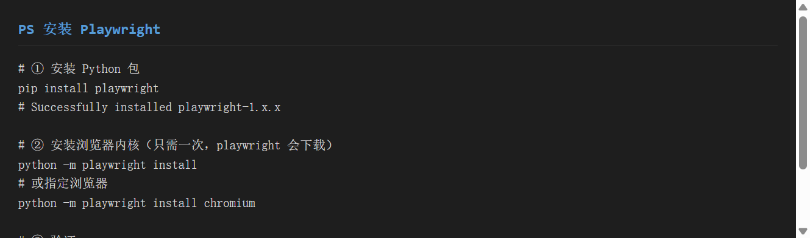
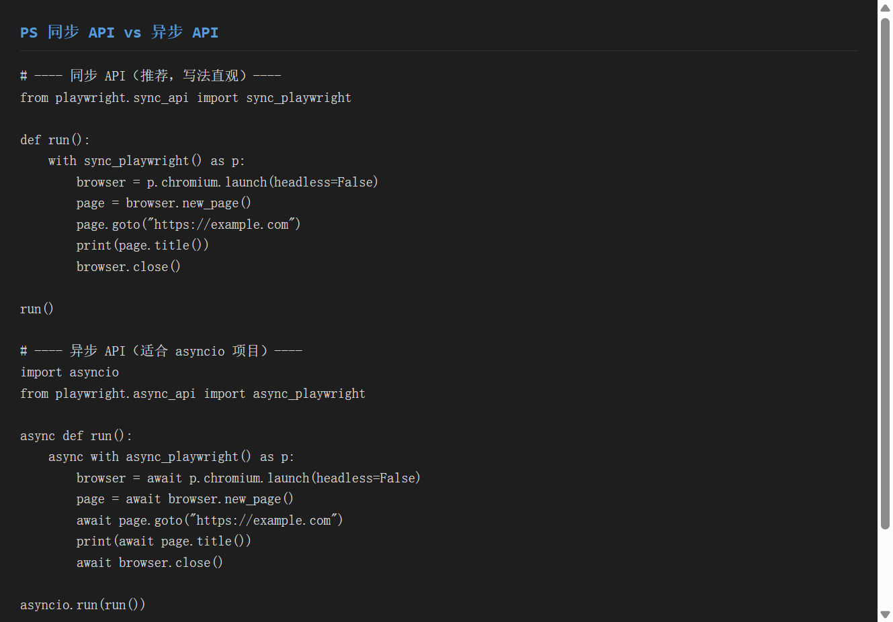
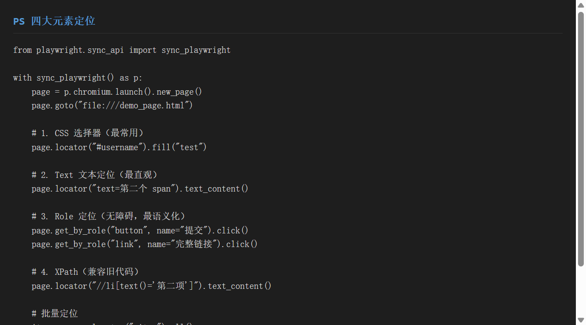
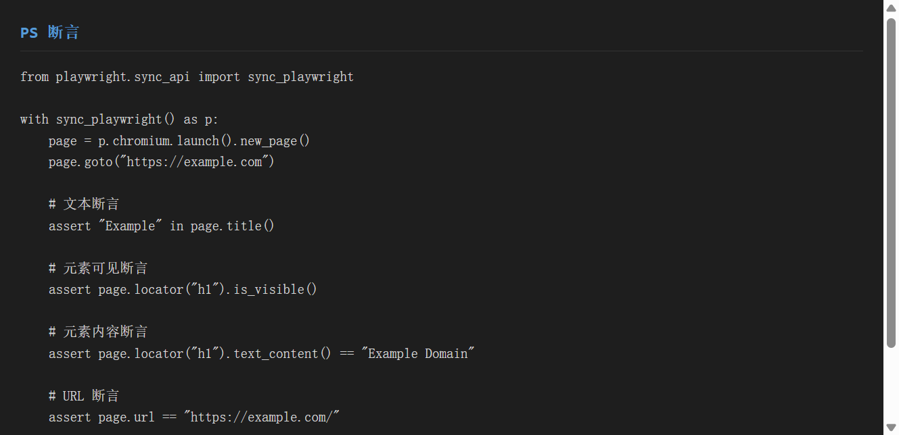
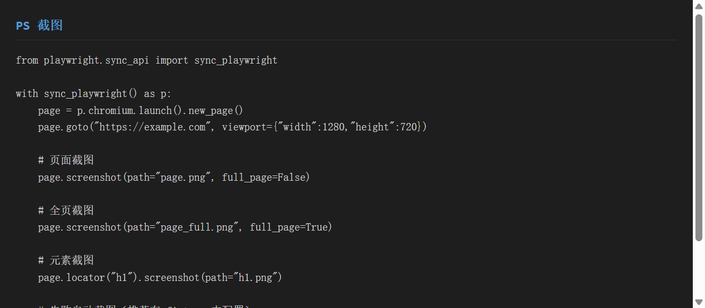
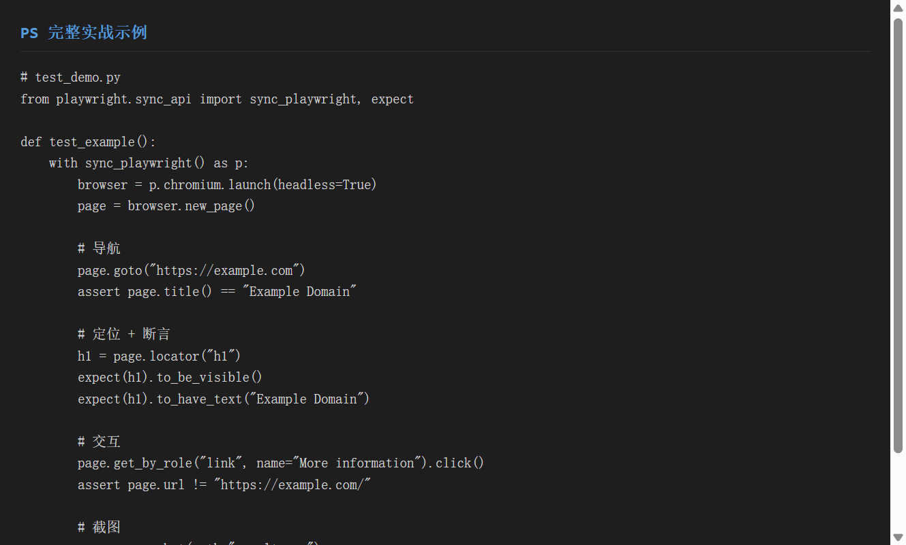
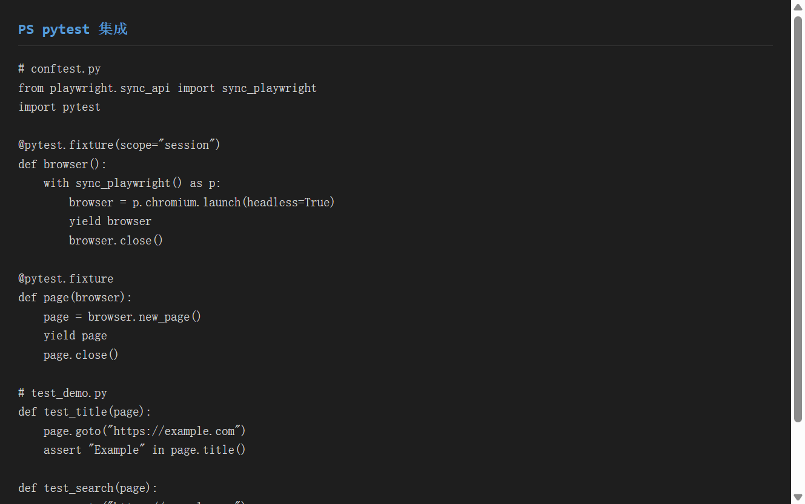

# 《Playwright 自动化》使用分享

> 工具：**Playwright**（Microsoft 出品的现代 Web 自动化框架）
> 适用系统：Windows / macOS / Linux
> 目标：一份文档教会你**安装、同步/异步 API、元素定位（CSS/XPath/Text/Role）、断言、截图**——比 Selenium 更现代、更稳定、自动等待

---

## 一、环境准备

### 1.1 安装

```bash
# ① 创建虚拟环境
python -m venv .venv
source .venv/Scripts/activate

# ② 安装 playwright Python 包
pip install playwright
# Successfully installed playwright-1.x.x

# ③ 安装浏览器内核（只需一次，playwright 会自动下载）
python -m playwright install
# 或指定浏览器
python -m playwright install chromium

# ④ 验证
python -c "from playwright.sync_api import sync_playwright; print('OK')"
# OK
```

> Playwright 会自动下载 Chromium / Firefox / WebKit 三个内核。安装可能需要几分钟，取决于网络。

### 1.2 为什么选择 Playwright（对比 Selenium）

| 特性 | Playwright | Selenium |
|------|-----------|---------|
| 等待机制 | **自动等待**（智能，无需手动写 wait） | 需手动写显式等待 |
| 浏览器内核 | 自带（自动下载） | 需手动安装 ChromeDriver |
| 并行执行 | 原生支持多浏览器并行 | 需 Selenium Grid |
| 速度 | 快（直接通信，不走 JSON Wire Protocol） | 较慢 |
| 生态 | 较新，文档正在完善 | 非常成熟 |
| 定位方式 | CSS / XPath / Text / Role（更丰富） | 8 种（含 link text） |


> ▲ 截图标注：红框标出 `pip install playwright` 和 `python -m playwright install chromium` 两个核心安装步骤。

---

## 二、同步 API vs 异步 API

Playwright 提供两套完全等价的 API，**同步 API 更易上手**，异步 API 适合 asyncio 项目。

### 2.1 同步 API（推荐）

```python
from playwright.sync_api import sync_playwright

def run():
    # 上下文管理器：自动启动和关闭
    with sync_playwright() as p:
        # 启动浏览器
        browser = p.chromium.launch(headless=False)  # headless=False 显示浏览器

        # 新建页面（相当于打开新标签）
        page = browser.new_page()

        # 导航到 URL
        page.goto("https://example.com")

        # 操作页面
        print(page.title())      # 获取标题
        print(page.url)          # 获取 URL

        # 关闭浏览器
        browser.close()

run()
```

### 2.2 异步 API

```python
import asyncio
from playwright.async_api import async_playwright

async def run():
    async with async_playwright() as p:
        browser = await p.chromium.launch(headless=False)
        page = await browser.new_page()
        await page.goto("https://example.com")
        print(await page.title())
        await browser.close()

asyncio.run(run())
```

### 2.3 同步 vs 异步对比

| 对比项 | 同步 API | 异步 API |
|--------|---------|---------|
| 导入 | `from playwright.sync_api import sync_playwright` | `from playwright.async_api import async_playwright` |
| 启动 | `with sync_playwright() as p:` | `async with async_playwright() as p:` |
| 启动浏览器 | `p.chromium.launch()` | `await p.chromium.launch()` |
| 打开页面 | `browser.new_page()` | `await browser.new_page()` |
| 导航 | `page.goto("url")` | `await page.goto("url")` |
| 获取标题 | `page.title()` | `await page.title()` |
| 关闭 | `browser.close()` | `await browser.close()` |

**记忆口诀**：同步 API 去掉所有 `await` 和 `async`，其余完全一致。


> ▲ 截图标注：红框标出同步和异步 API 的代码结构差异，重点对比 `sync_playwright` vs `async_playwright` 以及 `await` 的位置。

---

## 三、元素定位

Playwright 提供 **4 大定位器**，比 Selenium 的 8 种更精炼。

### 3.1 四大定位器一览

| 定位器 | 语法 | 适用场景 |
|--------|------|---------|
| **CSS 选择器** | `page.locator("#id")` | 最常用，速度快 |
| **XPath** | `page.locator("//li[text()='x']")` | 复杂层级、兼容旧代码 |
| **Text 文本** | `page.locator("text=提交")` | 最直观，按文本定位 |
| **Role 角色** | `page.get_by_role("button", name="提交")` | 无障碍语义，最稳定 |

### 3.2 各定位器详解

#### ① CSS 选择器（最常用）

```python
# id 定位（# 前缀）
page.locator("#username")

# class 定位（. 前缀）
page.locator(".submit-btn")

# 属性定位
page.locator("input[data-test='search']")

# 组合定位
page.locator("div.basicInfo.J-basic-info")
```

#### ② XPath 定位

```python
# text() 精确匹配
page.locator("//a[text()='登录']")

# 属性匹配
page.locator("//li[@data-id='3']")

# 模糊匹配
page.locator("//li[contains(text(), '项')]")
```

#### ③ Text 文本定位（Playwright 特色）

```python
# 精确文本
page.locator("text=第二个 span（目标）")

# 包含文本
page.locator("text=包含关键词")

# 正则匹配
page.locator("text=/正则表达式/")
```

> Text 定位是 Playwright 独有的优势——**不需要关心元素的 class/id，直接按用户看到的文本定位**，更接近真实用户行为。

#### ④ Role 定位（最语义化）

```python
# 按钮
page.get_by_role("button", name="提交").click()

# 链接
page.get_by_role("link", name="完整链接").click()

# 输入框
page.get_by_role("textbox", name="请输入邮箱").fill("test@example.com")

# 复选框
page.get_by_role("checkbox", name="同意协议").check()
```

> Role 定位基于 ARIA（无障碍）角色，**语义最强，页面改版也不容易失效**。

### 3.3 批量定位

```python
# 获取全部匹配元素
items = page.locator(".item").all()
print(f"共 {len(items)} 个元素")
for item in items:
    print(item.text_content())
```

### 3.4 常用操作

```python
# 获取文本
page.locator("h1").text_content()

# 输入文本
page.locator("#username").fill("test_user")

# 点击
page.locator("button").click()

# 获取属性
page.locator("a").get_attribute("href")

# 判断可见
page.locator("h1").is_visible()
```


> ▲ 截图标注：红框标出 CSS / Text / Role / XPath 四种定位的写法与适用场景。

---

## 四、断言

Playwright 的断言有两种写法：**原生 Python assert** 和 **expect API**（推荐）。

### 4.1 原生 assert（简单场景）

```python
from playwright.sync_api import sync_playwright

with sync_playwright() as p:
    page = p.chromium.launch().new_page()
    page.goto("https://example.com")

    # 文本断言
    assert "Example" in page.title()

    # 元素可见断言
    assert page.locator("h1").is_visible()

    # URL 断言
    assert page.url == "https://example.com/"

    # 属性断言
    href = page.locator("a").get_attribute("href")
    assert href is not None
```

### 4.2 expect API（推荐，自动等待）

```python
from playwright.sync_api import expect

with sync_playwright() as p:
    page = p.chromium.launch().new_page()
    page.goto("https://example.com")

    # 自动等待元素可见
    expect(page.locator("h1")).to_be_visible()

    # 自动等待文本匹配
    expect(page.locator("h1")).to_have_text("Example Domain")

    # 自动等待 URL 变化
    expect(page).to_have_url("https://example.com/")

    # 自动等待属性值
    expect(page.locator("a")).to_have_attribute("href", "https://...")
```

**expect 的优势**：
- **自动重试**：元素没出现时会自动等待（默认 5 秒），不会像 `assert` 那样立刻失败
- **失败信息更清晰**：会告诉你"期望什么、实际什么"
- **链式断言**：可连续写多个条件

### 4.3 常用断言方法

| 断言 | 说明 |
|------|------|
| `expect(locator).to_be_visible()` | 元素可见 |
| `expect(locator).to_be_hidden()` | 元素隐藏 |
| `expect(locator).to_have_text("xxx")` | 文本匹配 |
| `expect(locator).to_have_count(5)` | 数量匹配 |
| `expect(locator).to_have_attribute("href", "xxx")` | 属性匹配 |
| `expect(page).to_have_url("https://...")` | URL 匹配 |
| `expect(page).to_have_title("xxx")` | 标题匹配 |


> ▲ 截图标注：红框标出 `expect()` 链式断言的写法，以及 `to_be_visible` / `to_have_text` / `to_have_url` 三种常用断言。

---

## 五、截图

Playwright 的截图功能比 Selenium 更强大，支持**页面截图**和**元素截图**。

### 5.1 页面截图

```python
from playwright.sync_api import sync_playwright

with sync_playwright() as p:
    page = p.chromium.launch().new_page()
    page.goto("https://example.com", viewport={"width": 1280, "height": 720})

    # 视口截图（当前可见区域）
    page.screenshot(path="viewport.png")

    # 全页截图（滚动到底部拼接）
    page.screenshot(path="full_page.png", full_page=True)
```

### 5.2 元素截图

```python
# 截取单个元素
page.locator("h1").screenshot(path="h1.png")

# 截取多个元素
for i, item in enumerate(page.locator(".item").all()):
    item.screenshot(path=f"item_{i}.png")
```

### 5.3 失败自动截图

在测试框架中集成，用例失败时自动截图：

```python
# pytest 集成方式
@pytest.fixture
def page(browser):
    page = browser.new_page()
    yield page
    # 用例失败时截图
    if request.node.rep_call.failed:
        page.screenshot(path=f"fail_{request.node.name}.png")
```


> ▲ 截图标注：红框标出 `page.screenshot()` 和 `locator.screenshot()` 两种截图 API，以及 `full_page=True` 参数。

---

## 六、实战示例

### 6.1 完整测试脚本

```python
from playwright.sync_api import sync_playwright, expect

def test_example():
    with sync_playwright() as p:
        browser = p.chromium.launch(headless=True)
        page = browser.new_page()

        # ① 导航
        page.goto("https://example.com")
        assert page.title() == "Example Domain"

        # ② 断言标题
        expect(page.locator("h1")).to_be_visible()
        expect(page.locator("h1")).to_have_text("Example Domain")

        # ③ 点击链接
        page.get_by_role("link", name="More information").click()
        assert page.url != "https://example.com/"

        # ④ 截图
        page.screenshot(path="result.png")

        browser.close()
```

### 6.2 pytest 集成

```python
# conftest.py
from playwright.sync_api import sync_playwright
import pytest

@pytest.fixture(scope="session")
def browser():
    with sync_playwright() as p:
        browser = p.chromium.launch(headless=True)
        yield browser
        browser.close()

@pytest.fixture
def page(browser):
    page = browser.new_page()
    yield page
    page.close()

# test_demo.py
def test_title(page):
    page.goto("https://example.com")
    assert "Example" in page.title()

def test_search(page):
    page.goto("https://example.com")
    page.get_by_role("link", name="More information").click()
    assert page.url != "https://example.com/"
```

### 6.3 运行测试

```bash
pytest test_demo.py -v
# test_demo.py::test_title PASSED
# test_demo.py::test_search PASSED
```


> ▲ 截图标注：红框标出完整的 Playwright 测试脚本结构：启动 → 导航 → 断言 → 交互 → 截图。


> ▲ 截图标注：红框标出 conftest.py 中 `browser` / `page` fixture 的定义，以及 test 文件中的使用方式。

---

## 七、踩坑记录

### 7.1 浏览器下载超时

**现象**：`python -m playwright install` 下载 Chromium 超时。

**原因**：Playwright 的浏览器下载源在海外，国内网络不稳。

**解决**：
```bash
# 设置国内镜像（Playwright 支持）
PLAYWRIGHT_DOWNLOAD_HOST=https://npmmirror.com/mirrors/playwright python -m playwright install chromium
```

### 7.2 `headless=True` 时截图空白

**现象**：无头模式下 `page.screenshot()` 截到空白页。

**原因**：页面还没加载完就截图了。

**解决**：加 `wait_for_load_state` 或 `expect`。
```python
page.goto("https://example.com")
page.wait_for_load_state("networkidle")  # 等网络空闲
page.screenshot(path="result.png")
```

### 7.3 `locator` 返回多个元素时的操作

**现象**：`page.locator(".item").click()` 报错 `Error: locator.click: target has more than one element`。

**原因**：`.item` 匹配了多个元素，Playwright 不知道点击哪一个。

**解决**：用 `.first` / `.nth(i)` / `.last` 指定。
```python
page.locator(".item").first.click()           # 点击第一个
page.locator(".item").nth(1).click()          # 点击第二个（0-indexed）
page.locator(".item").last.click()            # 点击最后一个
```

### 7.4 Text 定位中文乱码

**现象**：`page.locator("text=提交")` 找不到元素。

**原因**：页面实际文本包含隐藏字符（如零宽空格、换行）。

**解决**：用正则或精确匹配。
```python
page.locator("text=/提交/")                    # 正则模糊匹配
page.locator("text=提交").filter(new=...).click()  # 先 filter 再操作
```

### 7.5 异步 API 忘记加 await

**现象**：`page.goto("url")` 报 `coroutine 'goto' was never awaited`。

**原因**：异步 API 的所有方法都是 coroutine，必须加 `await`。

**解决**：异步代码中**每个 Playwright 调用前都加 `await`**。或直接用同步 API 避免此问题。

### 7.6 页面关闭后操作报错

**现象**：`Error: Target page, context or browser has been closed`。

**原因**：在 `page.close()` 或 `browser.close()` 之后仍操作页面。

**解决**：确认操作在 `with` 上下文内完成，或 fixture 的 `yield` 之后不要操作 page。

---

## 八、总结

### 8.1 Playwright 优缺点

| 优点 | 缺点 |
|------|------|
| 自动等待，少写 sleep/wait | 生态较新，社区资源少于 Selenium |
| 自带浏览器内核，安装简单 | 浏览器体积大（~1GB） |
| 定位器丰富（Text/Role 是亮点） | 部分高级功能需付费（Test Generator） |
| 速度快，原生支持并行 | —— |
| 自动截图/录屏（trace） | —— |

### 8.2 ���用场景

| 场景 | 推荐用法 |
|------|---------|
| 新项目 Web 自动化 | Playwright（自动等待省心） |
| 从 Selenium 迁移 | Playwright（API 类似，学习成本低） |
| E2E 测试 | Playwright + pytest |
| 视觉回归测试 | Playwright 截图对比 |
| 已有 Selenium 项目 | 继续用 Selenium（迁移成本高） |

### 8.3 三句口诀

> 1. **同步够用就用同步**：`sync_playwright` 写法直观，除非项目已用 asyncio
> 2. **定位先 Text/Role，不行 CSS，复杂才 XPath**：Playwright 的 Text/Role 比 Selenium 的 link text 更强大
> 3. **断言用 expect，自动等待不慌**：`expect()` 自动重试，比原生 assert 更稳定

### 8.4 速查表

```python
# 同步启动
from playwright.sync_api import sync_playwright, expect
with sync_playwright() as p:
    browser = p.chromium.launch(headless=True)
    page = browser.new_page()
    page.goto("https://example.com")

# 四大定位
page.locator("#id")                        # CSS
page.locator("//li[text()='x']")           # XPath
page.locator("text=提交")                  # Text
page.get_by_role("button", name="提交")    # Role

# 断言
assert "Example" in page.title()
expect(page.locator("h1")).to_be_visible()
expect(page.locator("h1")).to_have_text("Example Domain")

# 截图
page.screenshot(path="page.png", full_page=True)
page.locator("h1").screenshot(path="h1.png")

# 常用操作
page.fill("#username", "test")             # 输入
page.click("button")                       # 点击
page.check("input[type='checkbox']")       # 勾选
page.select_option("select", "value")      # 下拉选择
page.evaluate("window.scrollTo(0, 100)")   # 执行 JS
page.wait_for_load_state("networkidle")    # 等待网络空闲
```

---

## 附：本文可复现的完整流程

```bash
cd playwright_demo
python demo.py
# 依次演示：同步 API / 异步 API / 四大定位 / 断言 / 截图 / 其他操作
```

> 截图脚本：`screenshot_playwright.py`（终端渲染图）+ `demo.py` 中真实截取的 `page_full.png` / `element.png`。
