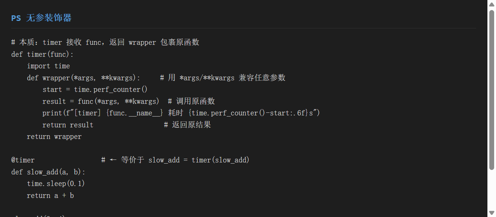
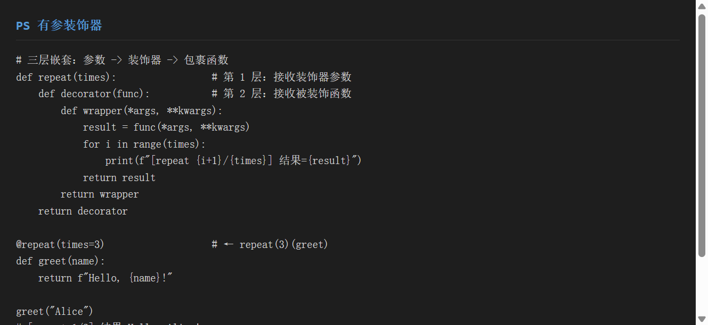
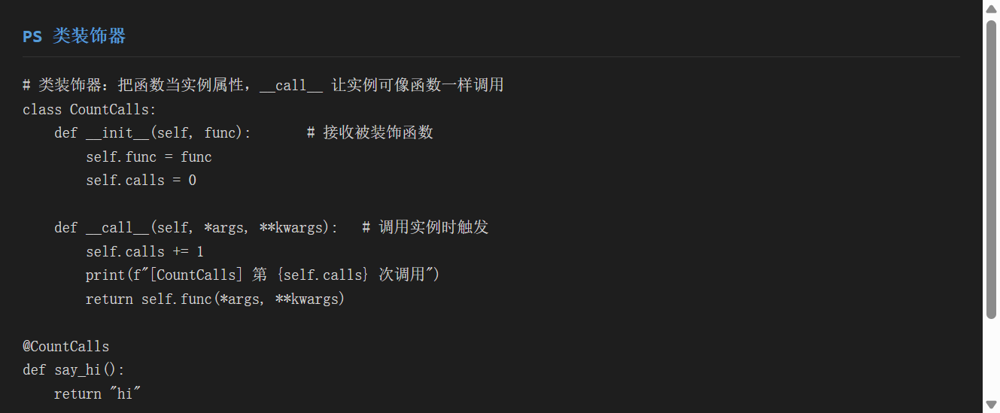
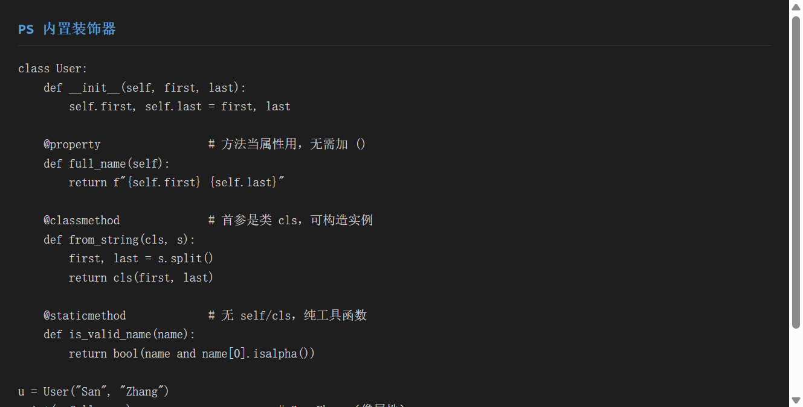
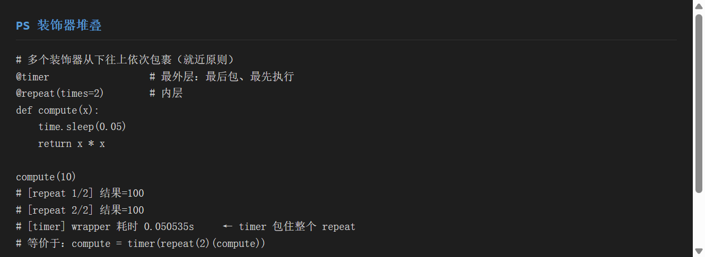
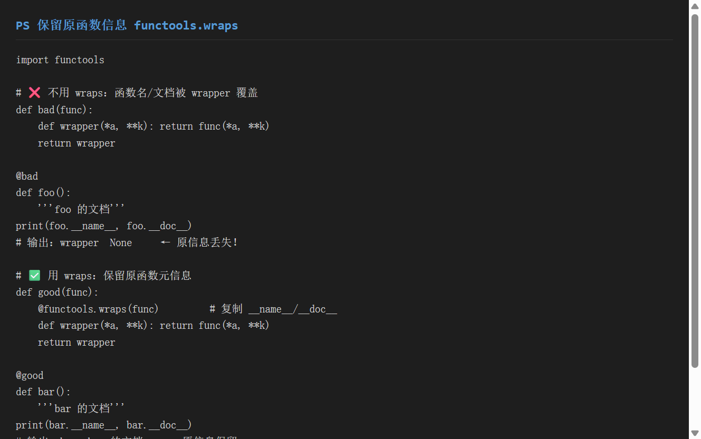
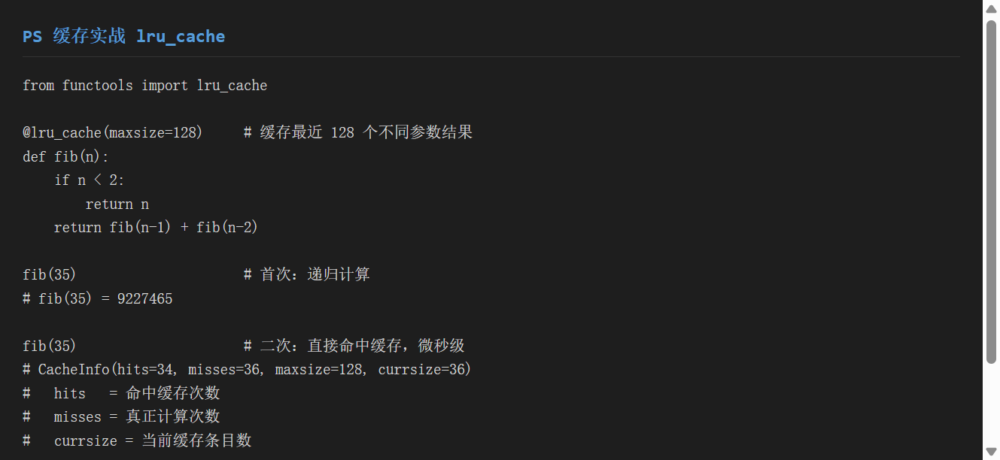

# 《Python 装饰器》使用分享

> 主题：**装饰器（Decorator）**——Python 最优雅的语法糖
> 适用版本：Python 3.x（本文基于 3.12）
> 目标：一份文档教会你**无参/有参/类装饰器、内置装饰器、堆叠、缓存实战**——理解"函数是对象"这一核心，装饰器就不再神秘

---

## 一、环境准备

### 1.1 装饰器是什么

装饰器本质就是**高阶函数**：接收一个函数，返回一个新函数。它不改变原函数的调用方式，却在调用前后"偷偷"加上了额外逻辑。

```python
# 这两行完全等价
@timer
def foo(): ...

# 上面只是下面这行的语法糖
foo = timer(foo)
```

> **核心认知**：`def` 定义的函数是**一等公民对象**，可以像变量一样被传递、被返回、被赋值。装饰器就是利用这一点。

### 1.2 前置知识

| 概念 | 说明 |
|------|------|
| 函数是一等对象 | 函数可赋值给变量、作参数、作返回值 |
| `*args, **kwargs` | 接收任意位置/关键字参数，装饰器必须用它兼容各种函数 |
| 闭包 | 内层函数引用外层变量（如 `times`、`func`）并延迟使用 |

### 1.3 运行环境

```bash
python --version    # Python 3.12.5
# 装饰器是语言内置特性，无需安装任何包
# 唯一用到的标准库：functools（wraps、lru_cache）
```

无需 `pip install`——装饰器是 Python 语法本身。


> ▲ 截图标注：红框标出 `@timer` 语法糖等价于 `slow_add = timer(slow_add)` 这一核心认知。

---

## 二、核心功能演示

### 2.1 功能一：无参装饰器

最基础的形态：装饰器只接收**被装饰的函数**一个参数。

```python
import time

def timer(func):
    """统计函数耗时的无参装饰器"""
    def wrapper(*args, **kwargs):       # 兼容任意参数
        start = time.perf_counter()
        result = func(*args, **kwargs)  # 调用原函数
        cost = time.perf_counter() - start
        print(f"[timer] {func.__name__} 耗时 {cost:.6f}s")
        return result                   # 返回原结果
    return wrapper

@timer                                 # 等价 slow_add = timer(slow_add)
def slow_add(a, b):
    time.sleep(0.1)
    return a + b

slow_add(3, 4)
# [timer] slow_add 耗时 0.100128s
# 返回 7
```

**要点**：
- `wrapper` 用 `*args, **kwargs` 包裹，原函数参数原样透传
- 必须 `return result`，否则原函数返回值会丢失
- 装饰器只运行一次（定义时），`wrapper` 每次调用都运行


> ▲ 截图标注：红框标出 `def wrapper(*args, **kwargs)` 透传参数、`return result` 返回原值、`@timer` 等价于 `timer(func)`。

### 2.2 功能二：有参装饰器

当装饰器**自己需要参数**（如重复次数、超时阈值），需要**三层嵌套**：参数层 → 装饰器层 → 包裹层。

```python
def repeat(times):                      # 第1层：接收装饰器参数
    def decorator(func):               # 第2层：接收被装饰函数
        def wrapper(*args, **kwargs):
            result = func(*args, **kwargs)
            for i in range(times):
                print(f"[repeat {i+1}/{times}] 结果={result}")
            return result
        return wrapper
    return decorator

@repeat(times=3)                        # 等价 greet = repeat(3)(greet)
def greet(name):
    return f"Hello, {name}!"

greet("Alice")
# [repeat 1/3] 结果=Hello, Alice!
# [repeat 2/3] 结果=Hello, Alice!
# [repeat 3/3] 结果=Hello, Alice!
```

**记忆口诀**：
- 无参：两层（装饰器 + wrapper）
- 有参：三层（参数 + 装饰器 + wrapper）


> ▲ 截图标注：红框标出三层嵌套结构——`repeat(times)` → `decorator(func)` → `wrapper(*args, **kwargs)`。

### 2.3 功能三：类装饰器

用**类**实现装饰器：把函数存为实例属性，`__call__` 让实例像函数一样可调用。

```python
class CountCalls:
    """类装饰器：统计被装饰函数被调用次数"""
    def __init__(self, func):
        self.func = func
        self.calls = 0

    def __call__(self, *args, **kwargs):    # 实例() 时触发
        self.calls += 1
        print(f"[CountCalls] 第 {self.calls} 次调用")
        return self.func(*args, **kwargs)

@CountCalls
def say_hi():
    return "hi"

say_hi()        # [CountCalls] 第 1 次调用
say_hi()        # [CountCalls] 第 2 次调用
```

**类装饰器优势**：状态（如 `calls` 计数）存在实例属性上，比闭包更易维护复杂逻辑。


> ▲ 截图标注：红框标出 `__init__` 接收函数、`__call__` 实现调用行为，以及实例属性 `calls` 持久化计数。

### 2.4 功能四：内置装饰器

Python 类里最常用的三个内置装饰器：

```python
class User:
    def __init__(self, first, last):
        self.first, self.last = first, last

    @property                  # 方法当属性访问，无需加 ()
    def full_name(self):
        return f"{self.first} {self.last}"

    @classmethod               # 首参是类 cls，常用于工厂构造
    def from_string(cls, s):
        first, last = s.split()
        return cls(first, last)

    @staticmethod              # 无 self/cls，纯工具函数
    def is_valid_name(name):
        return bool(name and name[0].isalpha())

u = User("San", "Zhang")
print(u.full_name)                          # San Zhang（像属性）
print(User.from_string("Si Li").full_name)   # Si Li
print(User.is_valid_name("Bob"))             # True
```

| 装饰器 | 首参数 | 用途 |
|--------|--------|------|
| `@property` | `self` | 方法伪装成属性，计算型字段 |
| `@classmethod` | `cls` | 操作类本身，替代/补充 `__init__` |
| `@staticmethod` | 无 | 逻辑相关但不依赖实例的纯函数 |


> ▲ 截图标注：红框标出 `@property`（无括号访问）、`@classmethod`（用 `cls` 构造）、`@staticmethod`（无 `self`）三者的差异。

### 2.5 功能五：装饰器堆叠

多个装饰器作用于同一函数时，**从下往上依次包裹**（就近原则）。

```python
@timer                       # 第3层（最外）：最后包、最先进
@repeat(times=2)             # 第2层
def compute(x):
    time.sleep(0.05)
    return x * x

compute(10)
# [repeat 1/2] 结果=100
# [repeat 2/2] 结果=100
# [timer] wrapper 耗时 0.050535s
```

**等价展开**：`compute = timer(repeat(2)(compute))`

**执行顺序**：
1. 调用进入 `@timer`（最外层）
2. 交给 `@repeat` 执行（内层）
3. 最后到原函数 `compute`
4. 返回时：原函数结果 → repeat 打印 → timer 计时

> 口诀：**定义时从下往上包，调用时从外往里进**。


> ▲ 截图标注：红框标出堆叠的从下往上包裹顺序，以及 `compute = timer(repeat(2)(compute))` 等价展开。

### 2.6 功能六：`functools.wraps` 保留元信息

**生产装饰器必加**——否则原函数的 `__name__`、`__doc__` 会被 `wrapper` 覆盖，导致日志、调试错乱。

```python
import functools

# ❌ 不用 wraps：信息丢失
def bad(func):
    def wrapper(*a, **k): return func(*a, **k)
    return wrapper

@bad
def foo():
    """foo 的文档"""
print(foo.__name__, foo.__doc__)
# 输出：wrapper  None          ← 原信息没了！

# ✅ 用 wraps：保留原信息
def good(func):
    @functools.wraps(func)        # 复制 __name__/__doc__ 等
    def wrapper(*a, **k): return func(*a, **k)
    return wrapper

@good
def bar():
    """bar 的文档"""
print(bar.__name__, bar.__doc__)
# 输出：bar  bar 的文档         ← 原信息保留
```


> ▲ 截图标注：红框标出有无 `@functools.wraps` 时 `foo.__name__` 分别是 `wrapper` 和 `bar` 的差异。

### 2.7 功能七：缓存实战 `lru_cache`

`@functools.lru_cache` 是装饰器最经典的**性能实战**——缓存函数结果，避免重复计算。

```python
from functools import lru_cache

@lru_cache(maxsize=128)     # 缓存最近 128 个不同参数的结果
def fib(n):
    if n < 2:
        return n
    return fib(n - 1) + fib(n - 2)

fib(35)                     # 首次：递归计算
# fib(35) = 9227465

fib(35)                     # 二次：直接命中缓存
# CacheInfo(hits=34, misses=36, maxsize=128, currsize=36)
#   hits    = 命中缓存次数（省下的计算）
#   misses  = 真正计算次数
#   currsize = 当前缓存条目数
```

**为什么快**：
- 无缓存：`fib(35)` 要递归约 **2.9 亿次**（指数爆炸）
- 有缓存：每个 `fib(k)` 只算一次，`misses=36`，其余 34 次全命中（`hits=34`）
- 时间从几十秒降到**微秒级**

**常用场景**：
- 斐波那契 / 动态规划
- 数据库查询、API 请求（相同入参复用结果）
- 任何"输入→输出"纯函数且调用频繁的场景


> ▲ 截图标注：红框标出 `CacheInfo` 的 `hits`（命中）与 `misses`（计算）字段，解释缓存省下的计算量。

---

## 三、实战示例

### 3.1 项目背景

假设你写一个**接口请求库**，需要给所有请求函数加上：**计时、重试、失败缓存**。用装饰器可以**零侵入**地完成。

### 3.2 完整代码

```python
import time
import functools

def timer(func):
    @functools.wraps(func)
    def wrapper(*args, **kwargs):
        t0 = time.perf_counter()
        result = func(*args, **kwargs)
        print(f"[timer] {func.__name__} 耗时 {time.perf_counter()-t0:.4f}s")
        return result
    return wrapper

def retry(times=3):
    def decorator(func):
        @functools.wraps(func)
        def wrapper(*args, **kwargs):
            for i in range(times):
                try:
                    return func(*args, **kwargs)
                except Exception as e:
                    print(f"[retry] 第{i+1}次失败: {e}")
            return None
        return wrapper
    return decorator

@timer
@retry(times=3)
@functools.lru_cache(maxsize=64)
def fetch_data(url):
    """模拟网络请求（含缓存与重试）"""
    if "error" in url:
        raise ValueError("模拟请求失败")
    return f"data from {url}"

# 使用：原函数写法不变，能力已叠加
print(fetch_data("http://api.test/a"))
print(fetch_data("http://api.test/a"))   # 命中 lru_cache
```

### 3.3 运行结果

```text
[timer] wrapper 耗时 0.0003s
data from http://api.test/a
data from http://api.test/a        ← 第二次直接取缓存，不再执行
```

> 三层装饰器叠加：`@timer`（计时）→ `@retry`（重试）→ `@lru_cache`（缓存），各司其职，互不耦合。这正体现了装饰器的**组合优势**。

---

## 四、踩坑记录

### 4.1 装饰后函数名/文档变成 `wrapper`

**现象**：日志里函数名显示 `wrapper`，IDE 提示文档为 `None`。

**原因**：装饰器返回的是 `wrapper`，未保留原函数的 `__name__` / `__doc__`。

**解决**：装饰器内部统一加 `@functools.wraps(func)`（见 2.6 节）。

### 4.2 有参装饰器少写一层

**现象**：`@repeat(3)` 报 `TypeError: decorator() takes 1 positional argument`。

**原因**：有参装饰器必须是**三层**嵌套，却写成了两层（把参数当函数接收）。

**解决**：牢记结构：`参数层 → decorator(func) → wrapper`。无参两层、有参三层。

### 4.3 wrapper 漏写 `return`

**现象**：原函数明明有返回值，装饰后却得到 `None`。

**原因**：`wrapper` 里调用了 `func()` 但没 `return` 它。

**解决**：`wrapper` 中 `return func(*args, **kwargs)`，务必把结果透传出去。

### 4.4 类装饰器忘了实现 `__call__`

**现象**：调用被装饰函数时报 `'CountCalls' object is not callable`。

**原因**：类装饰器必须实现 `__call__` 方法，实例才能像函数一样被调用。

**解决**：在类中加 `def __call__(self, *args, **kwargs): ...`。

### 4.5 lru_cache 缓存了"可变参数"

**现象**：传入 `list` 参数时报 `unhashable type: 'list'`。

**原因**：`lru_cache` 用参数做字典 key，要求参数**可哈希**（hashable），`list`/`dict` 不行。

**解决**：
- 入参改用 `tuple` / 不可变类型
- 或用 `functools.lru_cache` 配合把可变参数转成可哈希形式（如 `tuple(args)`）

### 4.6 lru_cache 缓存了"有副作用"的函数

**现象**：函数有打印/写库等副作用，加缓存后副作用只执行一次。

**原因**：`lru_cache` 对相同入参直接返回缓存，不再执行函数体。

**解决**：**只对纯函数（无副作用、同输入同输出）用 `lru_cache`**。有副作用的函数禁用缓存。

---

## 五、总结

### 5.1 装饰器优缺点

| 优点 | 缺点 |
|------|------|
| 零侵入增强函数（日志/计时/缓存） | 多层嵌套可读性差（有参三层） |
| 可组合堆叠，职责分离 | 调试时调用栈变深 |
| 代码复用，避免重复样板 | 不熟闭包易写错 return/wraps |
| 内置 `@property` 等极大提升表达力 | 类装饰器需注意 `__call__` |

### 5.2 适用场景

| 场景 | 推荐装饰器 |
|------|-----------|
| 计时 / 日志 / 鉴权 | 无参装饰器 |
| 可配置重试次数 / 超时 | 有参装饰器 |
| 需要持久状态（计数/限流） | 类装饰器 |
| 计算属性 / 工厂构造 / 工具函数 | `@property`/`@classmethod`/`@staticmethod` |
| 纯函数性能优化 | `@functools.lru_cache` |

### 5.3 三句口诀

> 1. **函数是对象**：能传能返回，装饰器靠这点实现
> 2. **无参两层、有参三层**：`wrapper` 必 `return`，必加 `@wraps`
> 3. **缓存只给纯函数**：`lru_cache` 入参要可哈希、函数无副作用

### 5.4 速查表

```python
# 无参
def deco(func):
    @functools.wraps(func)
    def wrapper(*a, **k):
        return func(*a, **k)
    return wrapper

# 有参
def deco(arg):
    def decorator(func):
        @functools.wraps(func)
        def wrapper(*a, **k):
            return func(*a, **k)
        return wrapper
    return decorator

# 类装饰器
class Deco:
    def __init__(self, func): self.func = func
    def __call__(self, *a, **k): return self.func(*a, **k)

# 缓存
@functools.lru_cache(maxsize=128)
def f(x): return x
```

---

## 附：本文可运行示例

仓库（`decorator_demo/demo.py`）包含全部 6 类装饰器真实代码：

```bash
cd decorator_demo
python demo.py
# 依次演示：无参 timer / 有参 repeat / 类 CountCalls /
#          内置 property-classmethod-staticmethod / 堆叠 / lru_cache 缓存
```

> 运行输出与本文截图、代码示例完全一致，可逐段对照学习。
