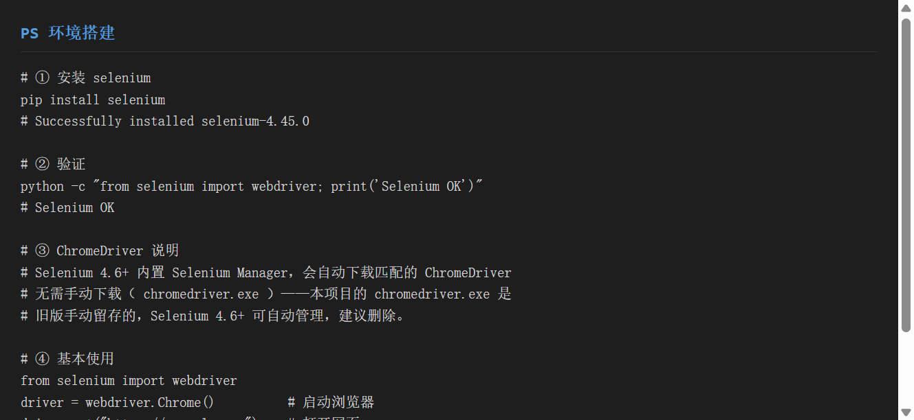
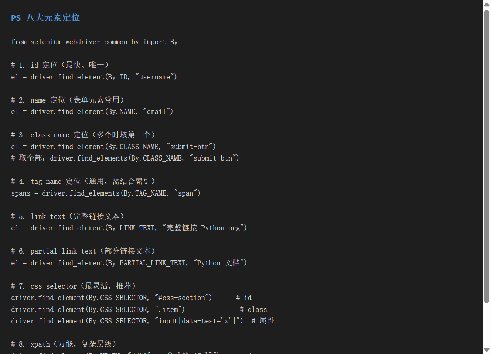
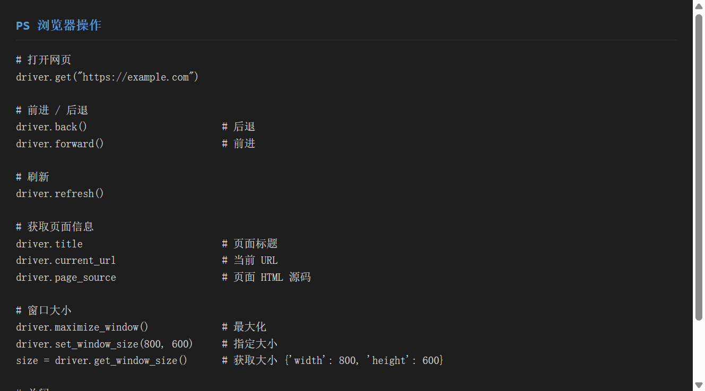
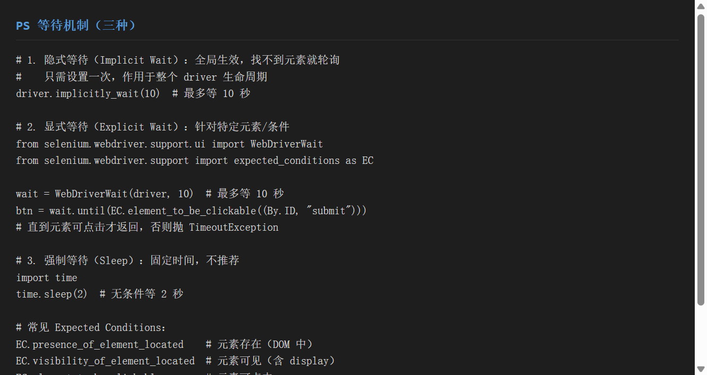
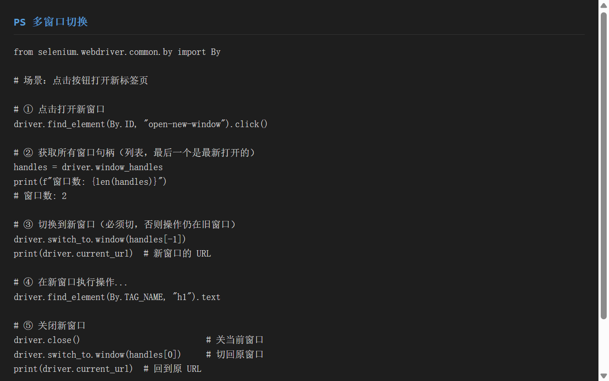
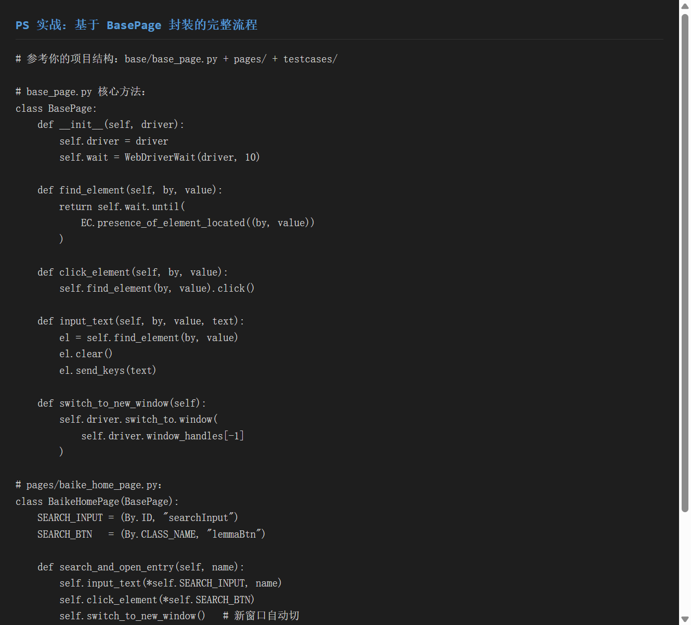
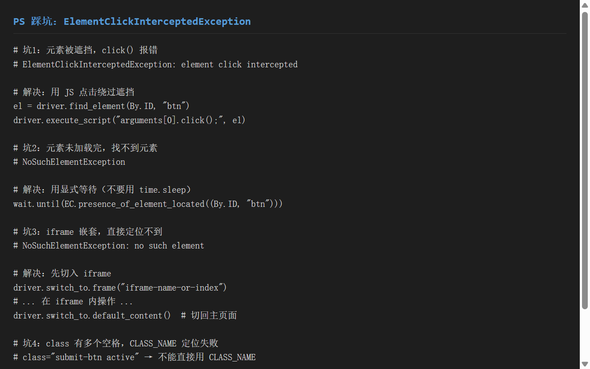

# 《Selenium Web 自动化》使用分享

> 工具：**Selenium**（浏览器自动化框架）
> 适用系统：Windows / macOS / Linux
> 目标：一份文档教会你**环境搭建、八大元素定位、浏览器操作、等待机制、多窗口切换**——结合你的 `baidu_baike_test` 项目实战

---

## 一、环境准备

### 1.1 安装 Selenium

```bash
# 创建虚拟环境（推荐，避免污染全局）
python -m venv .venv
source .venv/Scripts/activate    # Windows
# source .venv/bin/activate      # macOS/Linux

# 安装 selenium
pip install selenium
# Successfully installed selenium-4.45.0

# 验证
python -c "from selenium import webdriver; print('Selenium OK')"
# Selenium OK
```

### 1.2 ChromeDriver 管理

**Selenium 4.6+ 内置 Selenium Manager，会自动下载匹配的 ChromeDriver**，无需手动下载。

```python
from selenium import webdriver

# 自动查找 ChromeDriver（无需手动指定路径）
driver = webdriver.Chrome()

# 如果要用 Firefox
driver = webdriver.Firefox()
```

### 1.3 基本使用流程

```python
from selenium import webdriver

# ① 启动浏览器
driver = webdriver.Chrome()

# ② 打开网页
driver.get("https://baike.baidu.com/")

# ③ 获取页面信息
print(driver.title)           # 页面标题
print(driver.current_url)     # 当前 URL

# ④ 关闭浏览器
driver.quit()                 # 关闭整个浏览器（推荐）
# driver.close()              # 仅关闭当前标签页
```


> ▲ 截图标注：红框标出 `pip install selenium` 安装成功、`Selenium OK` 验证通过。

---

## 二、八大元素定位

Selenium 提供 **8 种元素定位方式**，通过 `By` 类指定：

```python
from selenium.webdriver.common.by import By
from selenium.webdriver.support.ui import WebDriverWait
from selenium.webdriver.support import expected_conditions as EC

wait = WebDriverWait(driver, 10)
```

### 2.1 完整定位方式对照表

| 序号 | 定位方式 | By 常量 | 示例 | 适用场景 |
|------|---------|---------|------|---------|
| 1 | **id** | `By.ID` | `driver.find_element(By.ID, "searchInput")` | 最快、唯一标识，**首选** |
| 2 | **name** | `By.NAME` | `driver.find_element(By.NAME, "email")` | 表单元素（input 的 name 属性） |
| 3 | **class name** | `By.CLASS_NAME` | `driver.find_element(By.CLASS_NAME, "lemmaBtn")` | class 不含空格时；多个同名取第一个 |
| 4 | **tag name** | `By.TAG_NAME` | `driver.find_elements(By.TAG_NAME, "span")` | 通用，通常需要配合索引 |
| 5 | **link text** | `By.LINK_TEXT` | `driver.find_element(By.LINK_TEXT, "登录")` | `<a>` 标签的完整文本 |
| 6 | **partial link text** | `By.PARTIAL_LINK_TEXT` | `driver.find_element(By.PARTIAL_LINK_TEXT, "百")` | `<a>` 标签的部分文本 |
| 7 | **css selector** | `By.CSS_SELECTOR` | `driver.find_element(By.CSS_SELECTOR, "#searchInput")` | 最灵活、速度最快，**推荐** |
| 8 | **xpath** | `By.XPATH` | `driver.find_element(By.XPATH, "//a[text()='登录']")` | 万能，复杂层级/文本匹配 |

### 2.2 各定位方式详解与代码示例

#### ① id 定位

```python
# 百度百科搜索框（id="searchInput"）
search_input = driver.find_element(By.ID, "searchInput")
search_input.send_keys("苹果")
```
> 最快最可靠，页面元素有 id 时**优先用 id**。

#### ② name 定位

```python
# 表单邮箱输入框（name="email"）
email_input = driver.find_element(By.NAME, "email")
email_input.send_keys("test@example.com")
```
> 常用于表单元素，唯一性仅次于 id。

#### ③ class name 定位

```python
# 百度百科搜索按钮（class="lemmaBtn"）
search_btn = driver.find_element(By.CLASS_NAME, "lemmaBtn")
search_btn.click()

# 注意：class 有多个空格时（如 class="submit-btn active"）
# 不能用 By.CLASS_NAME，要用 CSS 选择器
driver.find_element(By.CSS_SELECTOR, ".submit-btn.active")

# 取全部同名元素
all_buttons = driver.find_elements(By.CLASS_NAME, "submit-btn")
second_btn = all_buttons[1]
```
> `find_elements`（复数）返回列表，`find_element`（单数）返回第一个。

#### ④ tag name 定位

```python
# 获取页面所有 span
spans = driver.find_elements(By.TAG_NAME, "span")
print(f"共 {len(spans)} 个 span")
```
> 通常配合索引使用，单独用 tag 的场景较少。

#### ⑤ link text / ⑥ partial link text

```python
# 完整链接文本
login_link = driver.find_element(By.LINK_TEXT, "登录")
login_link.click()

# 部分链接文本（包含"登录"即可）
login_link = driver.find_element(By.PARTIAL_LINK_TEXT, "登")
login_link.click()
```
> 仅对 `<a>` 标签有效。

#### ⑦ css selector 定位（最推荐）

```python
# id 定位（# 前缀）
driver.find_element(By.CSS_SELECTOR, "#searchInput")

# class 定位（. 前缀）
driver.find_element(By.CSS_SELECTOR, ".lemmaBtn")

# 属性定位（[attr='value']）
driver.find_element(By.CSS_SELECTOR, "input[data-test='search']")

# 组合定位（class 含多个）
driver.find_element(By.CSS_SELECTOR, "div.basicInfo_Jl8VM.J-basic-info")

# 后代元素
driver.find_element(By.CSS_SELECTOR, "div.J-lemma-content img")
```

#### ⑧ xpath 定位（万能）

```python
# text() 精确匹配
driver.find_element(By.XPATH, "//a[text()='登录']")

# 属性匹配
driver.find_element(By.XPATH, "//li[@data-id='3']")

# 模糊匹配（contains）
driver.find_element(By.XPATH, "//li[contains(text(), '项')]")
driver.find_element(By.XPATH, "//a[contains(@href, '/item/')]")

# 层级关系
driver.find_element(By.XPATH, "//div[contains(@class, 'J-lemma-content')]//a")
```


> ▲ 截图标注：红框标出 8 种 `By.XXX` 定位方式的完整代码示例。

### 2.3 定位方式优先级建议

```
首选  By.ID             → 最快、唯一
次选  By.CSS_SELECTOR   → 灵活、速度好
备用  By.XPATH          → 复杂场景、文本匹配
避免  By.CLASS_NAME     → class 含空格时失效
极少  By.NAME / LINK_TEXT → 特定场景
```

baidu_baike_test` 项目中`BasePage.find_element()` 统一封装了前 5 种定位方式，`Pages` 层通过元组 `("css_selector", "h1.J-lemma-title")` 传入，实现了解耦。

---

## 三、浏览器操作

### 3.1 常用操作一览

```python
from selenium import webdriver

driver = webdriver.Chrome()
driver.maximize_window()           # 最大化窗口

driver.get("https://baike.baidu.com/")   # 打开网页
print(driver.title)                # 页面标题
print(driver.current_url)          # 当前 URL
print(driver.page_source[:500])    # 页面 HTML 源码（前500字符）

driver.back()                      # 后退
driver.forward()                   # 前进
driver.refresh()                   # 刷新

driver.set_window_size(800, 600)   # 指定大小
size = driver.get_window_size()    # 获取大小 {'width': 800, 'height': 600}
driver.maximize_window()           # 恢复最大化

driver.quit()                      # 关闭整个浏览器（释放驱动）
```

### 3.2 在你的项目中的应用

```python
# conftest.py 中的 driver fixture
@pytest.fixture(scope="session")
def driver():
    driver = webdriver.Chrome()
    driver.maximize_window()           # ← 浏览器操作
    driver.implicitly_wait(10)         # ← 隐式等待
    yield driver
    driver.quit()                      # ← 清理
```


> ▲ 截图标注：红框标出 `get`/`back`/`forward`/`refresh`/`set_window_size` 等常用方法。

---

## 四、等待机制

**等待是 Selenium 最核心的稳定器**——页面元素是异步加载的，不等就操作必然失败。

### 4.1 三种等待对比

| 等待类型 | 原理 | 优点 | 缺点 | 推荐度 |
|---------|------|------|------|--------|
| **隐式等待** | 全局轮询，找不到就一直等 | 设置一次，全局生效 | 对所有元素生效，不够精准 | ⭐⭐ 辅助用 |
| **显式等待** | 针对特定条件等待 | 精准、灵活 | 每个元素都要写 | ⭐⭐⭐ 主力 |
| **强制等待** | `time.sleep(N)` 固定等 | 简单 | 浪费时间、不稳定 | ❌ 不推荐 |

### 4.2 隐式等待

```python
driver.implicitly_wait(10)  # 全局生效，每次找元素最多等 10 秒
```
> 在你的项目中：`conftest.py` 里 `driver.implicitly_wait(10)` 设置了全局隐式等待。但**隐式等待不能替代显式等待**——它只等元素"存在"，不等"可点击"。

### 4.3 显式等待（主力）

```python
from selenium.webdriver.support.ui import WebDriverWait
from selenium.webdriver.support import expected_conditions as EC

wait = WebDriverWait(driver, 10)  # 最多等 10 秒

# 等元素存在（DOM 中）
el = wait.until(EC.presence_of_element_located((By.ID, "searchInput")))

# 等元素可见（display ≠ none）
el = wait.until(EC.visibility_of_element_located((By.ID, "searchInput")))

# 等元素可点击（最常见）
el = wait.until(EC.element_to_be_clickable((By.CLASS_NAME, "lemmaBtn")))

# 等 URL 包含指定文本（页面跳转后）
wait.until(EC.url_contains("history"))

# 等标题包含指定文本
wait.until(EC.title_contains("苹果"))
```

**在你的项目中的应用**：

```python
# base/base_page.py
class BasePage:
    def __init__(self, driver):
        self.driver = driver
        self.wait = WebDriverWait(driver, 10)  # ← 显式等待

    def find_element(self, locator_type, locator_value):
        if locator_type == "id":
            return self.wait.until(EC.presence_of_element_located((locator_type, locator_value)))
        # ...
```

### 4.4 强制等待（不推荐）

```python
import time
time.sleep(2)  # 无条件等 2 秒
```
> 只在调试时临时用。生产代码中**永远优先显式等待**。


> ▲ 截图标注：红框标出三种等待方式：隐式（`implicitly_wait`）、显式（`WebDriverWait` + `EC`）、强制（`time.sleep`），以及常用 Expected Conditions 列表。

---

## 五、多窗口切换

### 5.1 核心 API

```python
# 获取所有窗口句柄（列表）
handles = driver.window_handles
print(f"窗口数: {len(handles)}")  # 2

# 切换到最新打开的窗口
driver.switch_to.window(handles[-1])
print(driver.current_url)  # 新窗口的 URL

# 关闭当前窗口
driver.close()

# 切回原窗口
driver.switch_to.window(handles[0])
```

### 5.2 在你的项目中的应用

```python
# pages/baike_home_page.py
def search_and_open_entry(self, entry_name):
    self.input_text(*self.SEARCH_INPUT, entry_name)
    self.click_element_by_js(*self.SEARCH_BTN)
    self.switch_to_new_window()  # ← 点击后新标签页自动切换

# base/base_page.py
def switch_to_new_window(self):
    self.driver.switch_to.window(self.driver.window_handles[-1])
```

### 5.3 关键注意点

1. **必须先 `switch_to` 再操作**：新窗口打开后，Selenium 焦点仍在旧窗口
2. **`close()` 关的是"当前"窗口**：如果焦点在新窗口，`close()` 会关新窗口
3. **关闭后句柄列表会变**：`handles[0]` 在关闭后可能已失效，要及时切回
4. **如果 `window_handles` 只有 1 个**：新窗口可能被浏览器拦截，检查浏览器设置


> ▲ 截图标注：红框标出 `driver.window_handles` 获取句柄、`switch_to.window` 切换、`close` 关闭的正确顺序。

---

## 六、实战：以你的 baidu_baike_test 项目为例

### 6.1 项目结构回顾

```
baidu_baike_test/
├── base/
│   └── base_page.py          ← 基础封装层（八大定位 + 等待 + 操作）
├── pages/
│   ├── baike_home_page.py    ← 首页 Page 对象
│   └── baike_entry_page.py   ← 词条页 Page 对象
├── testcases/
│   └── test_baike_entry.py   ← 测试用例
└── conftest.py               ← driver 夹具 + 失败截图钩子
```

### 6.2 BasePage 层封装了什么

```python
# base/base_page.py
from selenium.webdriver.support.ui import WebDriverWait
from selenium.webdriver.support import expected_conditions as EC

class BasePage:
    def __init__(self, driver):
        self.driver = driver
        self.wait = WebDriverWait(driver, 10)  # 显式等待

    # 核心：统一入口，支持 5 种定位方式
    def find_element(self, locator_type, locator_value):
        if locator_type == "id":
            return self.wait.until(EC.presence_of_element_located((locator_type, locator_value)))
        elif locator_type == "xpath":
            return self.wait.until(EC.presence_of_element_located((locator_type, locator_value)))
        elif locator_type == "css_selector":
            return self.wait.until(EC.presence_of_element_located(("css selector", locator_value)))
        elif locator_type == "name":
            return self.wait.until(EC.presence_of_element_located((locator_type, locator_value)))
        elif locator_type == "class_name":
            return self.wait.until(EC.presence_of_element_located(("class name", locator_value)))

    # 操作封装
    def click_element(self, locator_type, locator_value): ...
    def click_element_by_js(self, locator_type, locator_value): ...
    def input_text(self, locator_type, locator_value, text): ...
    def get_element_text(self, locator_type, locator_value): ...
    def count_elements(self, locator_type, locator_value): ...
    def switch_to_new_window(self): ...
    def scroll_to_element(self, locator_type, locator_value): ...
```

### 6.3 Pages 层怎么用

```python
# pages/baike_home_page.py
from base.base_page import BasePage

class BaikeHomePage(BasePage):
    # 元素定位器（用元组传递 By 类型 + 值）
    SEARCH_INPUT = ("class_name", "searchInput")       # ← By.CLASS_NAME
    SEARCH_BTN = ("class_name", "lemmaBtn")
    LOGIN_BTN = ("xpath", "//a[text()='登录']")        # ← By.XPATH
    CREATE_ENTRY_BTN = ("css_selector", "div.createBtn_uMe8N")  # ← By.CSS_SELECTOR

    # 业务操作
    def search_and_open_entry(self, entry_name):
        self.input_text(*self.SEARCH_INPUT, entry_name)     # 解包元组
        self.click_element_by_js(*self.SEARCH_BTN)          # JS 点击（绕过遮挡）
        self.switch_to_new_window()                          # 自动切新窗口
```

### 6.4 在你的项目中使用了哪些定位方式

| 定位方式 | 使用位置 | 示例 |
|---------|---------|------|
| `class_name` | 搜索框、搜索按钮 | `("class_name", "searchInput")` |
| `xpath` | 登录按钮、内链、版权 | `("xpath", "//a[text()='登录']")` |
| `css_selector` | 标题、目录、信息卡片 | `("css_selector", "h1.J-lemma-title")` |
| `[class*='']` 属性包含 | 动态 class（哈希后缀） | `("css_selector", "a[class*='catalogItem']")` |


> ▲ 截图标注：红框标出你的 `baidu_baike_test` 项目中 `BasePage` 的 `find_element` 封装结构，以及 `Pages` 层定位器定义方式。

---

## 七、踩坑记录

### 7.1 元素被遮挡：`ElementClickInterceptedException`

**现象**：点击按钮时报 `element click intercepted`。

**原因**：页面有弹窗/遮罩层覆盖在目标元素上。

**解决**：用 JS 点击绕过视觉遮挡。

```python
# 不推荐（被拦截）
element.click()

# 推荐（JS 直接触发）
driver.execute_script("arguments[0].click();", element)
```

> 你的项目中：`BasePage.click_element_by_js()` 封装了 JS 点击，所有按钮都用这个方法。

### 7.2 元素找不到：`NoSuchElementException`

**现象**：`find_element` 报 `no such element`。

**原因**：元素还没加载完，或者定位器写错。

**解决**：
```python
# ① 加显式等待（推荐）
wait.until(EC.presence_of_element_located((By.ID, "xxx")))

# ② 检查定位器是否正确（在浏览器 DevTools 中验证）
#    $0 复制元素 → CSS Selector / XPath 生成器

# ③ 检查是否在 iframe 内
driver.switch_to.frame("iframe-name")
```

### 7.3 class 含多个空格，`CLASS_NAME` 定位失败

**现象**：`By.CLASS_NAME, "submit-btn active"` 报错。

**原因**：`CLASS_NAME` 只接受**单个** class 名，不含空格。

**解决**：改用 CSS 选择器。
```python
driver.find_element(By.CSS_SELECTOR, ".submit-btn.active")
```

### 7.4 多窗口操作后 session 失效

**现象**：`InvalidSessionIdException: invalid session id`。

**原因**：`driver.close()` 关闭了当前（原）窗口，导致 session 丢失。

**解决**：
```python
# 先切到新窗口
driver.switch_to.window(driver.window_handles[-1])
# ... 在新窗口操作 ...
driver.close()                        # 关新窗口
driver.switch_to.window(driver.window_handles[0])  # 切回原窗口
```

### 7.5 百度百科 class 名带哈希后缀

**现象**：上次能跑通的用例，过段时间大面积 `TimeoutException`。

**原因**：百度百科使用 CSS Modules，class 名带哈希后缀（如 `lemmaTitle_P6YNB`），每次部署都会变。

**解决**：
- 优先用 `J-` 前缀的稳定 class：`h1.J-lemma-title`
- 哈希后缀用属性包含匹配：`a[class*='catalogItem']`
- 无稳定 class 的元素改用 `src`/`href`/`text()` 定位

> 详见你的 `BAIDU_BAIKE_UI_AUTOMATION_GUIDE.md` 踩坑记录 10.4 节。

### 7.6 隐式等待 + 显式等待混用导致超时翻倍

**现象**：`WebDriverWait` 等一个元素要 20 秒才超时（设置了 10 秒）。

**原因**：隐式等待和显式等待会**叠加**——显式等待每次轮询时，隐式等待也会触发轮询。

**解决**：项目中统一用显式等待，隐式等待只设一个很小的兜底值或不设。
```python
# conftest.py 建议改为：
driver.implicitly_wait(0)  # 或删除，完全靠显式等待
```


> ▲ 截图标注：红框标出 4 个常见坑与对应的解决代码：JS 点击绕过遮挡、显式等待替代 sleep、CSS 选择器处理多空格 class、iframe 切入。

---

## 八、总结

### 8.1 Selenium 优缺点

| 优点 | 缺点 |
|------|------|
| 支持所有主流浏览器 | 速度慢（真实浏览器） |
| API 成熟稳定，文档丰富 | 元素定位 brittle（页面一改就挂） |
| 与 Python/Java 等多语言集成 | 维护成本高（页面变化需改定位器） |
| 社区生态齐全 | 不适合大规模并发（需 Grid） |

### 8.2 适用场景

| 场景 | 推荐用法 |
|------|---------|
| Web UI 自动化 | Selenium + Page Object 模式 |
| 批量数据采集 | Selenium（JS 渲染页面） |
| 回归测试 | Selenium + pytest + Allure |
| 性能测试 | 不适合（用 Locust / JMeter） |

### 8.3 三句口诀

> 1. **定位先 id，不行 css selector，复杂才 xpath**
> 2. **等元素用显式等待，别 time.sleep**
> 3. **新窗口先 switch_to，再操作，再 close，再切回**

### 8.4 速查表

```python
# 启动与关闭
driver = webdriver.Chrome()
driver.get("https://xxx")
driver.quit()

# 八大定位
By.ID, By.NAME, By.CLASS_NAME, By.TAG_NAME
By.LINK_TEXT, By.PARTIAL_LINK_TEXT
By.CSS_SELECTOR, By.XPATH

# 等待
driver.implicitly_wait(10)                            # 隐式
wait = WebDriverWait(driver, 10)                      # 显式
wait.until(EC.presence_of_element_located((By.ID, "x")))
wait.until(EC.element_to_be_clickable((By.ID, "x")))

# 多窗口
handles = driver.window_handles
driver.switch_to.window(handles[-1])
driver.close()
driver.switch_to.window(handles[0])

# JS 点击（绕过遮挡）
driver.execute_script("arguments[0].click();", element)
```

---

## 附：本文与你的项目对照

| 文档概念 | 你的 `baidu_baike_test` 项目中的对应 |
|---------|-----------------------------------|
| `webdriver.Chrome()` | `conftest.py` 的 `driver` fixture |
| `BasePage.find_element` | `base/base_page.py` 统一封装 5 种定位 |
| `@timer` / JS 点击 | `click_element_by_js()` 绕过遮挡 |
| `WebDriverWait` | `BasePage.__init__` 中的 `self.wait` |
| `switch_to_new_window` | `base/base_page.py` + `pages/baike_home_page.py` |
| 八大定位 | 项目中使用 `class_name` / `xpath` / `css_selector` + `[class*='']` |
| 踩坑记录 | 你的项目实际踩过的坑（click intercepted、懒加载、动态 class） |

> 这份 Selenium 文档以你的 `baidu_baike_test` 项目为**主要参考示例**，每个概念都能在你的代码中找到对应实现。建议对照阅读，理解 BasePage 层的封装思路。
