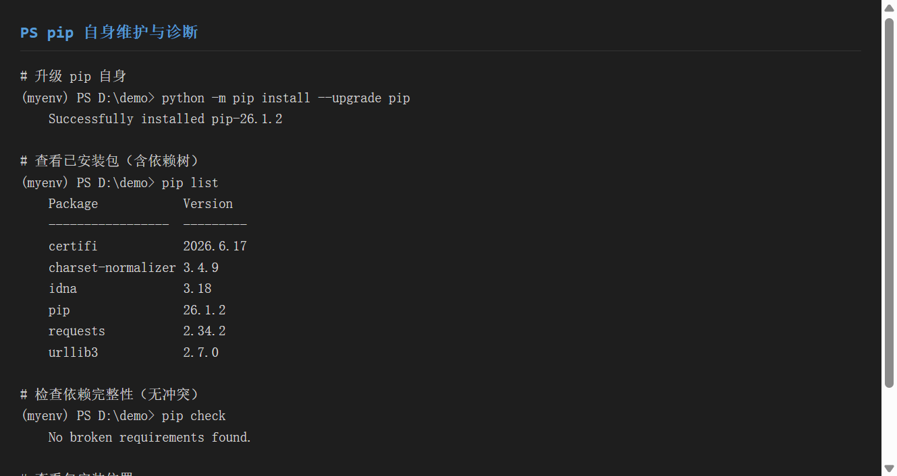
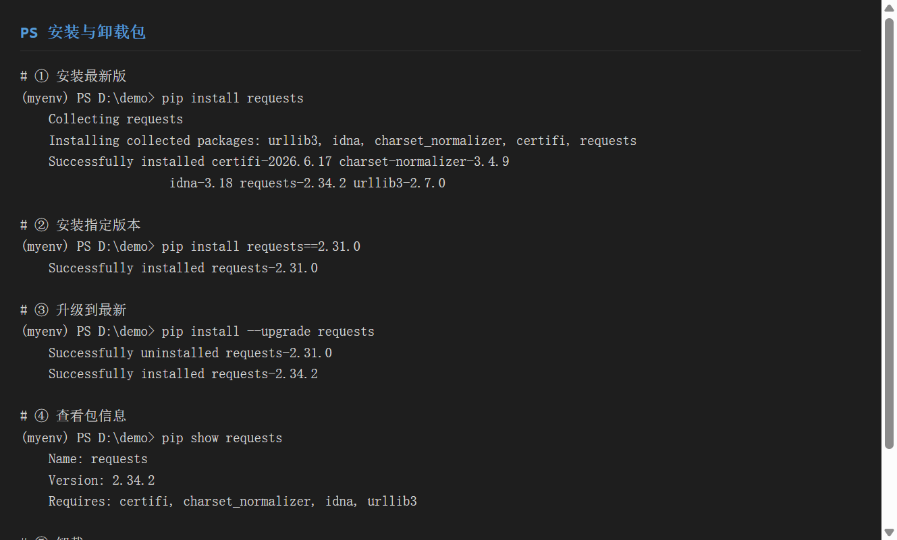
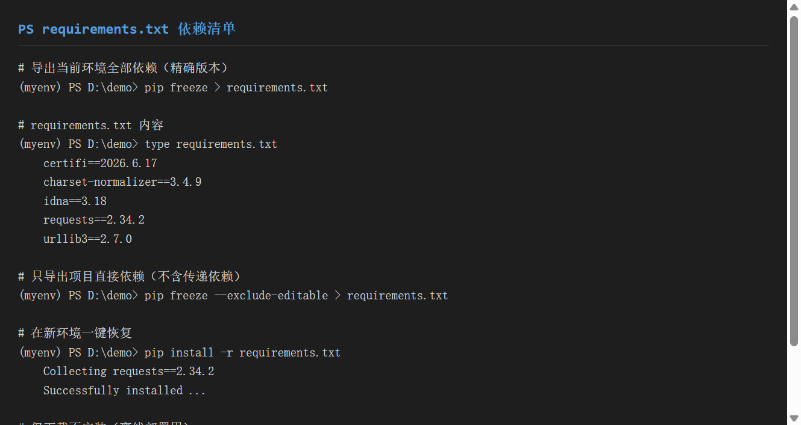
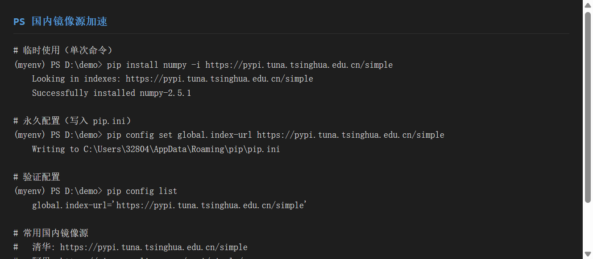
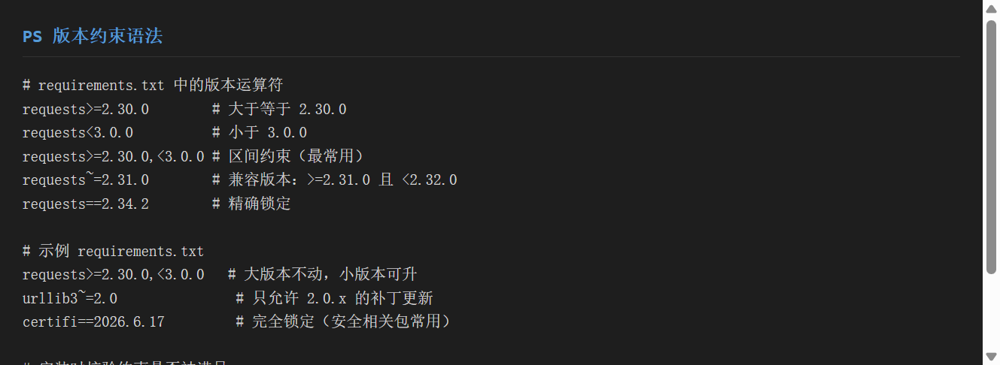
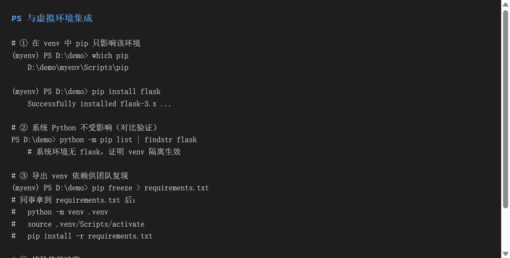

# 《pip 包管理方法》使用分享

工具：**pip**（Python 官方包管理器）
适用系统：Windows / macOS / Linux（本文命令以 Windows 终端为主，bash 通用）
目标：一份文档教会你**装/卸包、管依赖、配镜像、锁版本、接 venv**——不再被 `ImportError` 和网速折磨

---

## 一、环境准备

### 1.1 版本要求

| 项目 | 要求 |
|------|------|
| Python | **2.7.9+** 或 **3.4+**，`pip` 已随 Python 自带 |
| 推荐 pip 版本 | ≥ 24.x |

> **关键认知**：装好 Python 后一般已有 `pip`。验证一下：
```bash
python -m pip --version
# pip 26.1.2 from ...\site-packages\pip (python 3.12)
```
> 始终用 `python -m pip` 而非裸 `pip`——它能确保调用的是**当前 Python 解释器**对应的 pip，避免多版本混乱。

### 1.2 升级 pip 自身

```bash
# 升级到最新版
python -m pip install --upgrade pip
# Successfully installed pip-26.1.2
```


> ▲ 截图标注：红框标出 `pip --version` 输出中的版本号，以及升级后的 `pip-26.1.2` 安装成功提示。

### 1.3 国内镜像源（必配，否则下载慢/超时）

```bash
# 临时使用（单次命令加 -i）
pip install numpy -i https://pypi.tuna.tsinghua.edu.cn/simple
```

常用国内镜像源：

| 镜像源 | 地址 |
|--------|------|
| 清华大学 | `https://pypi.tuna.tsinghua.edu.cn/simple` |
| 阿里云 | `https://mirrors.aliyun.com/pypi/simple/` |
| 腾讯云 | `https://mirrors.cloud.tencent.com/pypi/simple` |
| 豆瓣 | `https://pypi.douban.com/simple/` |

---

## 二、核心功能演示

### 2.1 功能一：安装 / 卸载包

**① 安装最新版**

```bash
(myenv) PS D:\demo> pip install requests
Collecting requests
Installing collected packages: urllib3, idna, charset_normalizer, certifi, requests
Successfully installed certifi-2026.6.17 charset-normalizer-3.4.9 idna-3.18 requests-2.34.2 urllib3-2.7.0
```
> 注意：`requests` 会自动带上 4 个**依赖包**一起装——这就是"传递依赖"。

**② 安装指定版本**

```bash
(myenv) PS D:\demo> pip install requests==2.31.0
Successfully installed requests-2.31.0
```

**③ 升级到最新**

```bash
(myenv) PS D:\demo> pip install --upgrade requests
Successfully uninstalled requests-2.31.0
Successfully installed requests-2.34.2
```

**④ 查看包信息**

```bash
(myenv) PS D:\demo> pip show requests
Name: requests
Version: 2.34.2
Requires: certifi, charset_normalizer, idna, urllib3   # 它依赖哪些包
Required-by:                                          # 哪些包依赖它
Location: D:\demo\myenv\Lib\site-packages
```

**⑤ 卸载**

```bash
(myenv) PS D:\demo> pip uninstall -y requests
Successfully uninstalled requests-2.34.2
```
> `-y` 表示自动确认，脚本中常用；交互模式可省略。

**⑥ 仅下载不安装（离线部署）**

```bash
pip download requests -d ./pkgs --no-deps
# Saved ./pkgs/requests-2.34.2-py3-none-any.whl
```
> 在**有网的机器**下载 `.whl`，拷到**无网的机器**用 `pip install ./pkgs/*.whl` 安装。


> ▲ 截图标注：红框标出 `install` 成功行、`--upgrade` 的卸载+重装两行、`uninstall` 成功行。

### 2.2 功能二：requirements.txt 依赖清单

**① 导出当前环境全部依赖（精确版本）**

```bash
(myenv) PS D:\demo> pip freeze > requirements.txt
```

生成的 `requirements.txt`：

```text
certifi==2026.6.17
charset-normalizer==3.4.9
idna==3.18
requests==2.34.2
urllib3==2.7.0
```

**② 在新环境一键恢复**

```bash
(myenv) PS D:\demo> pip install -r requirements.txt
Collecting requests==2.34.2
Successfully installed requests-2.34.2 urllib3-2.7.0 ...
```
> 团队协作 / CI 部署的核心：别人拿到 `requirements.txt` 即可复现**完全一致**的环境。

**③ 只导出"直接依赖"（推荐做法）**

`pip freeze` 会把所有传递依赖都列出来，文件很长。更干净的方式是**手写** `requirements.txt`，只写你直接 `import` 的包：

```text
# requirements.txt（手写版，只列直接依赖）
requests>=2.30.0
flask
numpy
```

**④ 离线下载整份依赖**

```bash
pip download -r requirements.txt -d ./pkgs
```


> ▲ 截图标注：红框标出 `requirements.txt` 的 `包名==版本` 精确格式，以及 `pip install -r` 恢复命令。

### 2.3 功能三：国内镜像源

**① 临时使用（单次）**

```bash
pip install numpy -i https://pypi.tuna.tsinghua.edu.cn/simple
# Looking in indexes: https://pypi.tuna.tsinghua.edu.cn/simple
# Successfully installed numpy-2.5.1
```

**② 永久配置（推荐）**

```bash
# 写入用户级配置
pip config set global.index-url https://pypi.tuna.tsinghua.edu.cn/simple
# Writing to C:\Users\32804\AppData\Roaming\pip\pip.ini
```

验证配置生效：

```bash
(myenv) PS D:\demo> pip config list
global.index-url='https://pypi.tuna.tsinghua.edu.cn/simple'
```

> 配置文件位置：
> - Windows：`C:\Users\<用户名>\AppData\Roaming\pip\pip.ini`
> - macOS/Linux：`~/.pip/pip.conf` 或 `~/.config/pip/pip.conf`

**③ 多源场景**：主源 + 私有源

```bash
pip install my-pkg \
  -i https://pypi.tuna.tsinghua.edu.cn/simple \
  --extra-index-url https://mirrors.aliyun.com/pypi/simple/
```


> ▲ 截图标注：红框标出镜像源 URL（`https://pypi.tuna.tsinghua.edu.cn/simple`），以及 `pip config list` 的确认输出。

### 2.4 功能四：版本约束

在 `requirements.txt` 中，版本运算符决定 pip 装哪个版本：

| 运算符 | 含义 | 示例 | 允许的版本 |
|--------|------|------|-----------|
| `==` | 精确锁定 | `requests==2.34.2` | 仅 2.34.2 |
| `>=` | 最低版本 | `requests>=2.30.0` | ≥ 2.30.0 |
| `<=` | 最高版本 | `requests<=3.0.0` | ≤ 3.0.0 |
| `<` / `>` | 严格区间 | `requests<3.0.0` | < 3.0.0 |
| `>=A,<B` | 区间约束 | `requests>=2.30.0,<3.0.0` | 2.30.0 ~ 2.99.x |
| `~=` | 兼容版本 | `urllib3~=2.0` | ≥2.0.0 且 <2.1.0 |
| 无符号 | 任意最新 | `flask` | 最新版 |

**实战示例**：

```text
# requirements.txt
requests>=2.30.0,<3.0.0   # 大版本不动，允许小版本升级（最常用）
urllib3~=2.0               # 只允许 2.0.x 补丁更新，避免引入破坏性变更
certifi==2026.6.17         # 安全相关包完全锁定
numpy                      # 不锁版本，始终用最新
```

安装时 pip 自动解析并满足约束：

```bash
(myenv) PS D:\demo> pip install -r requirements.txt
Successfully installed requests-2.34.2 urllib3-2.7.0 certifi-2026.6.17
```

记忆口诀**：`==` 锁死、`>=` 保底、`<` 封顶、`~=` 小步快跑、区间最稳。


> ▲ 截图标注：红框标出 `>=A,<B` 区间约束与 `~=` 兼容版本两种最常用写法。

### 2.5 功能五：与虚拟环境集成

pip 与 venv 是**黄金搭档**——在 venv 里跑 `pip`，所有包只装进该环境的 `Lib/site-packages`，不碰系统 Python。

**① 激活 venv 后，pip 路径自动指向环境内**

```bash
(myenv) PS D:\demo> which pip
D:\demo\myenv\Scripts\pip      # 指向 venv 内部

(myenv) PS D:\demo> pip install flask
Successfully installed flask-3.x ...
```

**② 对比验证：系统 Python 不受影响**

```bash
PS D:\demo> python -m pip list | findstr flask
# 空输出 —— 系统环境里没有 flask，隔离生效
```

**③ 导出 venv 依赖供团队复现**

```bash
(myenv) PS D:\demo> pip freeze > requirements.txt
# 同事拿到后：
python -m venv .venv
source .venv/Scripts/activate
pip install -r requirements.txt
```

**④ 校验依赖冲突**

```bash
(myenv) PS D:\demo> pip check
No broken requirements found.   # 无冲突，依赖关系健康
```


> ▲ 截图标注：红框标出 `(myenv)` 提示符下 `which pip` 指向 `myenv\Scripts\pip`，证明 pip 已绑定虚拟环境。

### 2.6 功能六：pip 自身维护与诊断

```bash
# 列出已装包
pip list
# Package            Version
# -----------------  ---------
# certifi            2026.6.17
# requests           2.34.2
# urllib3            2.7.0

# 检查依赖是否完整、有无冲突
pip check
# No broken requirements found.

# 查看包安装位置
pip show requests
# Location: D:\demo\myenv\Lib\site-packages
```


> ▲ 截图标注：红框标出 `pip list` 表格与 `pip check` 无冲突提示。

---

## 三、实战示例

### 3.1 项目背景

你要开发一个**接口自动化测试项目**，需要 `requests`（发请求）、`pytest`（跑测试）、`allure-pytest`（出报告）。要求：
- 依赖全部锁定，交同事一键复现
- 用清华镜像加速
- 严格隔离，不污染系统

### 3.2 完整操作流程

```bash
# ① 建并激活虚拟环境
mkdir api_test && cd api_test
python -m venv .venv
source .venv/Scripts/activate        # (bash) 或 .venv\Scripts\Activate.ps1 (PS)

# ② 配置国内镜像（永久）
pip config set global.index-url https://pypi.tuna.tsinghua.edu.cn/simple

# ③ 安装直接依赖（用区间约束稳一点）
pip install "requests>=2.30.0,<3.0.0" pytest allure-pytest

# ④ 写代码（test_api.py）
#   import requests, pytest ...

# ⑤ 运行测试
pytest test_api.py --alluredir=allure-results

# ⑥ 导出依赖清单（提交 Git）
pip freeze > requirements.txt

# ⑦ 同事复现
git clone <repo> && cd api_test
python -m venv .venv && source .venv/Scripts/activate
pip install -r requirements.txt
pytest
```

### 3.3 最终结果

`api_test/` 目录结构：

```
api_test/
├── .venv/              # 虚拟环境（加入 .gitignore）
├── test_api.py         # 测试代码
├── requirements.txt    # 锁定依赖：requests==2.34.2 等
└── .gitignore          # 忽略 .venv/
```

`requirements.txt` 内容（节选）：

```text
requests==2.34.2
pytest==9.1.1
allure-pytest==2.16.0
# ... 及它们的传递依赖
```

> 各步骤截图对应：②镜像（step03）、③安装（step01）、⑥导出（step02）、venv集成（step05）。组合即完整流程。

---

## 四、踩坑记录

### 4.1 `pip` 装到了全局而非 venv

**现象**：`pip list` 在 venv 里看不到刚装的包，系统 Python 里却有。

**原因**：忘了激活 venv，直接用了系统 `pip`。

**解决**：
- 激活后用 `which pip` 确认路径含 `myenv`
- 或改用绝对路径：`myenv/Scripts/pip install requests`
- 永远优先 `python -m pip install ...`（绑定当前解释器）

### 4.2 下载超时 / 连接被拒

**现象**：
```text
pip._vendor.urllib3.exceptions.ReadTimeoutError
WARNING: Retrying ...
```

**原因**：默认连 pypi.org，国内网络不稳。

**解决**：
```bash
# 临时换源
pip install xxx -i https://pypi.tuna.tsinghua.edu.cn/simple

# 或加大超时
pip install xxx --timeout 60
```
> 根治方案：按 2.3 节永久配置国内镜像。

### 4.3 `pip install` 报 `ERROR: Could not find a version`

**现象**：指定的版本号装不上，提示找不到。

**原因**：版本号写错，或该版本不支持当前 Python。

**解决**：
```bash
# 查看包有哪些可用版本
pip index versions requests        # pip ≥ 21.2
# 或
pip install requests==            # 报错信息会列出可用版本

# 确认 Python 版本兼容（如 requests 2.x 需 Python ≥ 3.8）
python --version
```

### 4.4 依赖冲突：`pip check` 报红

**现象**：
```text
requests 2.34.2 requires urllib3<3, but you have urllib3 3.0.0
```

**原因**：两个包对同一依赖要求不兼容版本。

**解决**：
```bash
# 1. 用 pip install 自动降级/升级到兼容版本
pip install "urllib3<3"

# 2. 或用 constraints 文件约束
echo "urllib3<3" > constraints.txt
pip install -r requirements.txt -c constraints.txt

# 3. 复杂项目推荐上 poetry / pip-tools 做依赖解析
```

### 4.5 卸载不干净 / 残留文件

**现象**：`pip uninstall` 后，某些文件还在 `site-packages`。

**原因**：包安装时写入了非标准路径，或手动改过。

**解决**：
```bash
# 强制重装再卸
pip install --force-reinstall xxx
pip uninstall -y xxx

# 彻底清理：直接删 site-packages 对应目录
# 路径用 pip show xxx 的 Location 字段定位
```

### 4.6 在 venv 里 `pip` 命令不存在

**现象**：激活后执行 `pip` 报 `command not found`。

**原因**：venv 创建时 pip 未就绪（极少见），或 PATH 异常。

**解决**：
```bash
# 用 python -m pip 兜底
python -m pip install requests

# 若 venv 损坏，重建
rm -rf .venv
python -m venv .venv
```

---

## 五、总结

### 5.1 pip 优缺点

| 优点 | 缺点 |
|------|------|
| Python 官方标配，零成本上手 | 依赖解析能力弱（易冲突） |
| 命令简洁，生态全覆盖 | 无原生 lock 文件（靠 `freeze`） |
| 镜像源/离线部署都支持 | 大项目依赖树管理不如 poetry |
| 与 venv 集成无缝 | —— |

### 5.2 适用场景

| 场景 | 推荐做法 |
|------|---------|
| 个人小项目 | `pip install` + `requirements.txt` + venv |
| 团队协作交付 | venv + 锁版本 `requirements.txt` + 国内镜像 |
| 离线/内网环境 | `pip download` 预下载 + 拷贝安装 |
| 复杂依赖管理 | 进阶用 `pip-tools` / `poetry`（基于 pip） |

### 5.3 三条铁律

> 1. **永远在 venv 里用 pip** —— 不污染系统
> 2. **永远 `python -m pip`** —— 不调错解释器
> 3. **永远提交 `requirements.txt`** —— 不提交 `.venv`

### 5.4 速查表

```bash
# 安装
pip install requests                 # 最新
pip install requests==2.31.0         # 指定版本
pip install -r requirements.txt      # 批量
pip install -i <镜像URL> requests    # 临时换源

# 卸载 / 升级
pip uninstall -y requests
python -m pip install --upgrade pip

# 依赖管理
pip freeze > requirements.txt       # 导出
pip download -r requirements.txt -d ./pkgs   # 离线下载
pip check                            # 冲突检查

# 镜像（永久）
pip config set global.index-url https://pypi.tuna.tsinghua.edu.cn/simple
```

---

## 附：版本约束速查

```text
requests==2.34.2        # 精确
requests>=2.30.0        # 最低
requests<3.0.0          # 最高
requests>=2.30.0,<3.0.0 # 区间（推荐）
requests~=2.0           # 兼容（2.0.x）
```
