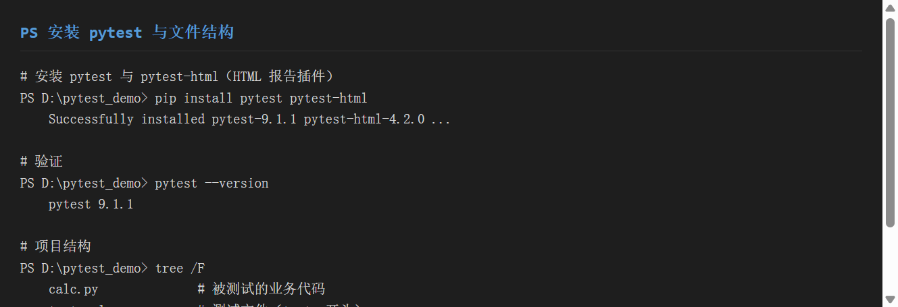
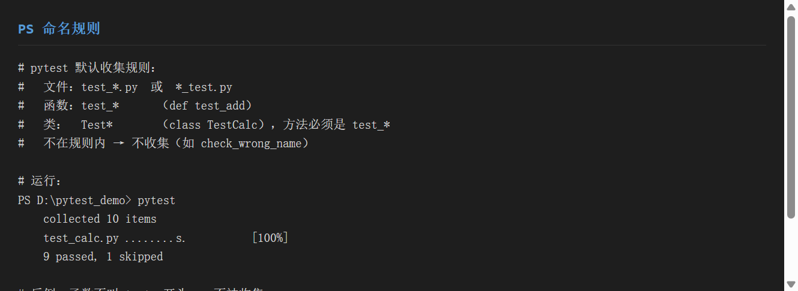
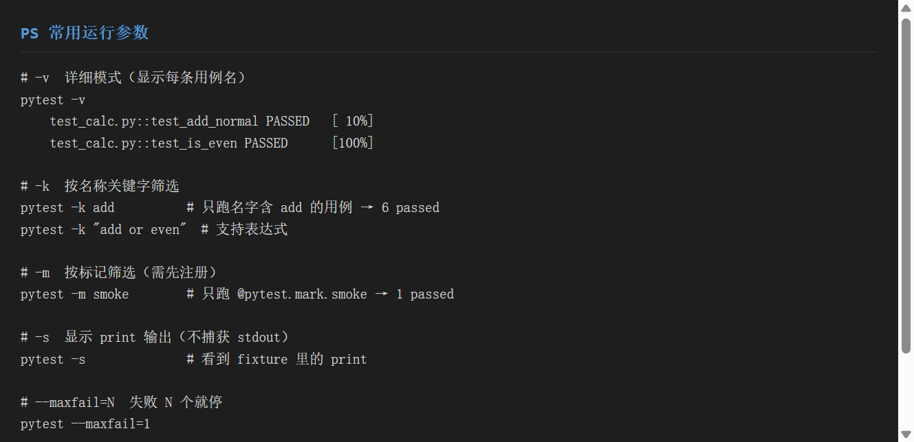
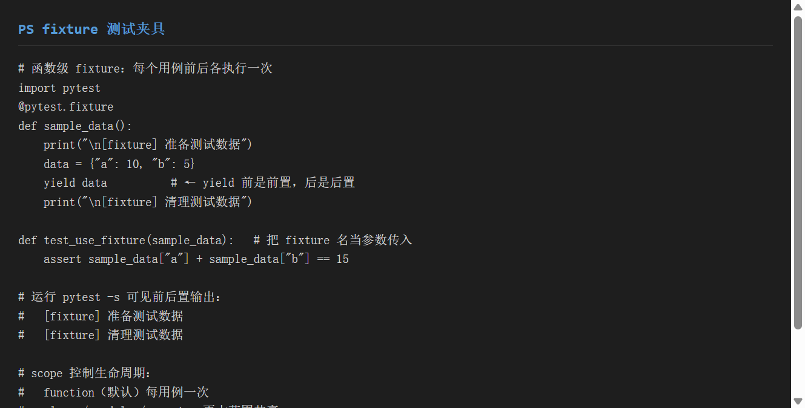
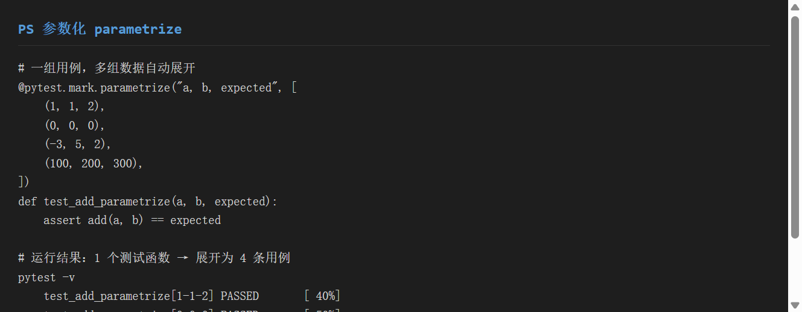
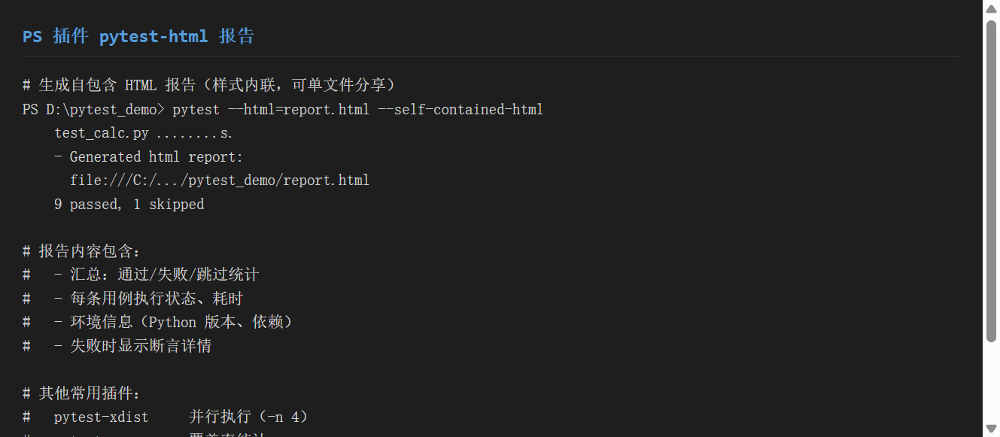
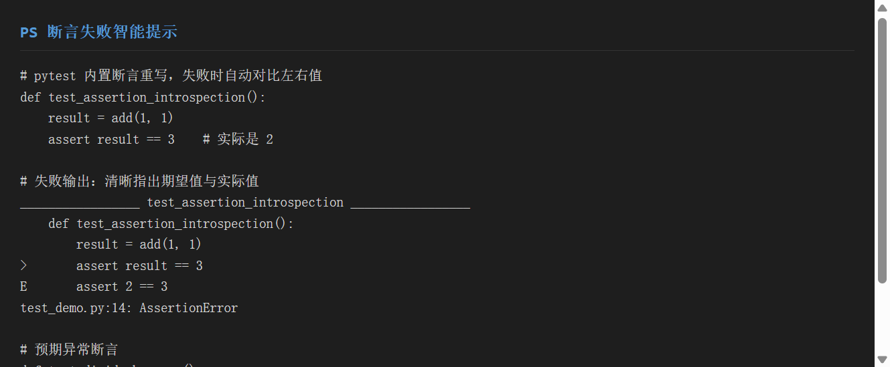

# 《pytest 单元测试框架》使用分享

> 工具：**pytest**（Python 主流测试框架）+ **pytest-html**（HTML 报告插件）
> 适用系统：Windows / macOS / Linux
> 目标：一份文档教会你**装框架、懂命名、用参数、写 fixture、做参数化、配插件**——让测试从"能跑"到"好维护"

---

## 一、环境准备

### 1.1 安装

```bash
# 安装 pytest 核心 + pytest-html 报告插件
pip install pytest pytest-html

# 验证版本
pytest --version
# pytest 9.1.1
```

> 建议在**虚拟环境**中安装（见前两份分享文档），避免污染全局。

### 1.2 项目结构约定

```text
pytest_demo/
├── calc.py          # 被测试的业务代码
├── test_calc.py     # 测试文件（test_ 开头）
├── conftest.py      # 跨文件共享 fixture（可选）
├── pytest.ini       # pytest 配置文件（可选，注册标记等）
└── report.html      # 生成的测试报告（运行后产生）
```


> ▲ 截图标注：红框标出 `pytest --version` 输出的版本号（pytest 9.1.1），以及 `tree` 展示的 `test_` 前缀文件结构。

### 1.3 被测试代码示例（calc.py）

```python
def add(a, b):
    return a + b

def divide(a, b):
    if b == 0:
        raise ValueError("除数不能为 0")
    return a / b

def is_even(n):
    return n % 2 == 0
```

---

## 二、核心功能演示

### 2.1 功能一：命名规则

pytest 依靠**命名约定**自动发现用例，无需注册：

| 对象 | 规则 | 示例 |
|------|------|------|
| 测试文件 | `test_*.py` 或 `*_test.py` | `test_calc.py` |
| 测试函数 | `test_` 开头 | `def test_add():` |
| 测试类 | `Test` 开头，**无 `__init__`** | `class TestCalc:` |
| 测试方法 | `test_` 开头 | `def test_add(self):` |

**不符合规则的不会被收集**：

```python
# ❌ 不会被执行（函数名不以 test_ 开头）
def check_wrong_name():
    assert add(1, 1) == 2
```

运行最简单的命令即可自动收集执行：

```bash
pytest
# collected 10 items
# test_calc.py ........s.              [100%]
# 9 passed, 1 skipped
```


> ▲ 截图标注：红框标出 `collected 10 items` 统计，以及 `9 passed, 1 skipped` 汇总——证明命名正确的用例被自动收集。

### 2.2 功能二：常用运行参数

| 参数 | 作用 | 示例 |
|------|------|------|
| `-v` | 详细模式，显示每条用例名 | `pytest -v` |
| `-s` | 不捕获 stdout，显示 `print` 输出 | `pytest -s` |
| `-k` | 按名称关键字筛选 | `pytest -k add` |
| `-m` | 按标记（mark）筛选 | `pytest -m smoke` |
| `--maxfail=N` | 失败 N 个就停止 | `pytest --maxfail=1` |
| `-x` | 第一个失败即停 | `pytest -x` |
| `--html=报告.html` | 生成 HTML 报告 | `pytest --html=report.html` |

**示例**：

```bash
# 详细模式：逐条展示用例状态
pytest -v
# test_calc.py::test_add_normal PASSED        [ 10%]
# test_calc.py::test_is_even PASSED           [100%]

# -k 关键字筛选：只跑名字含 add 的用例
pytest -k add
# 6 passed, 4 deselected

# -m 标记筛选：只跑 @pytest.mark.smoke 标记的用例
pytest -m smoke
# 1 passed, 9 deselected
```


> ▲ 截图标注：红框标出 `-v`、`-k`、`-m`、`--html` 四类最常用参数的写法与效果。

### 2.3 功能三：fixture（测试夹具）

fixture 是 pytest 的**灵魂**，负责用例的**前置准备 + 后置清理**，通过 `yield` 分隔：

```python
import pytest

@pytest.fixture
def sample_data():
    print("\n[fixture] 准备测试数据")   # 前置：用例前执行
    data = {"a": 10, "b": 5}
    yield data                          # 把数据交给用例
    print("\n[fixture] 清理测试数据")   # 后置：用例后执行

def test_use_fixture(sample_data):      # 把 fixture 名当参数传入
    assert sample_data["a"] + sample_data["b"] == 15
```

加 `-s` 运行可见前后置 print：

```bash
pytest test_calc.py::test_use_fixture -s
# [fixture] 准备测试数据
# [fixture] 清理测试数据
```

**scope 控制生命周期**：

| scope | 范围 | 执行次数 |
|-------|------|---------|
| `function`（默认） | 每个用例 | 每用例一次 |
| `class` | 每个测试类 | 每类一次 |
| `module` | 每个文件 | 每文件一次 |
| `session` | 整个会话 | 全程一次 |

```python
# 会话级：整个测试过程只建一次（如数据库连接）
@pytest.fixture(scope="session")
def db_connection():
    print("\n[conftest] 建立数据库连接")
    conn = {"status": "connected"}
    yield conn
    print("\n[conftest] 关闭数据库连接")
```

**`conftest.py` 共享 fixture**：放在该文件的 fixture 对所有测试文件自动生效，无需 import。


> ▲ 截图标注：红框标出 `@pytest.fixture` 装饰器与 `yield` 前（前置）/ 后（后置）的结构，以及 `test_use_fixture(sample_data)` 的参数传入方式。

### 2.4 功能四：参数化（parametrize）

**一组用例，多组数据自动展开**——避免复制粘贴多个 `test_xxx` 函数。

```python
import pytest
from calc import add

@pytest.mark.parametrize("a, b, expected", [
    (1, 1, 2),
    (0, 0, 0),
    (-3, 5, 2),
    (100, 200, 300),
])
def test_add_parametrize(a, b, expected):
    assert add(a, b) == expected
```

运行结果：1 个函数 → 自动展开为 **4 条独立用例**：

```bash
pytest -v
# test_add_parametrize[1-1-2] PASSED        [ 40%]
# test_add_parametrize[0-0-0] PASSED        [ 50%]
# test_add_parametrize[-3-5-2] PASSED       [ 60%]
# test_add_parametrize[100-200-300] PASSED  [ 70%]
```

> 用例名末尾 `[1-1-2]` 是参数组合，失败时一眼看出是哪组输入出错。


> ▲ 截图标注：红框标出 `@pytest.mark.parametrize` 的 4 组参数列表，以及展开后的 4 条带 `[参数]` 后缀的用例。

### 2.5 功能五：插件（pytest-html 报告）

**生成自包含 HTML 报告**（样式内联，单文件即可分享）：

```bash
pytest --html=report.html --self-contained-html
# test_calc.py ........s.
# - Generated html report:
#   file:///C:/.../pytest_demo/report.html
# 9 passed, 1 skipped
```

报告包含：

- 汇总统计：通过 / 失败 / 跳过数量
- 每条用例：状态、耗时
- 环境信息：Python 版本、已装包
- 失败时：断言详情


> ▲ 截图标注：红框标出 `Generated html report:` 及生成的 `report.html` 路径。

**常用插件一览**：

| 插件 | 作用 |
|------|------|
| `pytest-html` | 生成 HTML 报告（本例） |
| `pytest-xdist` | 并行执行（`-n 4` 开 4 进程） |
| `pytest-cov` | 代码覆盖率统计 |
| `pytest-rerunfailures` | 失败自动重跑 |
| `allure-pytest` | 生成 Allure 美观报告（见百度百科分享） |

### 2.6 功能六：断言与错误提示

pytest **无需 `self.assertEqual`**，直接用原生 `assert`，失败时会**自动对比左右值**：

```python
def test_assertion_introspection():
    result = add(1, 1)
    assert result == 3    # 实际是 2，会失败
```

失败输出清晰指出期望值与实际值：

```text
_________________ test_assertion_introspection _________________
    def test_assertion_introspection():
        result = add(1, 1)
>       assert result == 3
E       assert 2 == 3
test_demo.py:14: AssertionError
```

**预期异常断言**：

```python
import pytest
from calc import divide

def test_divide_by_zero():
    with pytest.raises(ValueError):
        divide(1, 0)    # 期望抛 ValueError，不抛则用例失败
```

**跳过与标记**：

```python
import pytest

@pytest.mark.skip(reason="功能尚未实现")
def test_future_feature():
    assert is_even(4)

@pytest.mark.smoke        # 自定义标记（需在 pytest.ini 注册）
def test_is_even():
    assert is_even(4) is True
```

`pytest.ini` 注册标记（消除警告）：

```ini
[pytest]
markers =
    smoke: 冒烟测试用例
```


> ▲ 截图标注：红框标出 `E assert 2 == 3` 的失败对比行，以及 `with pytest.raises(...)` 预期异常写法。

---

## 三、实战示例

### 3.1 项目背景

为 `calc.py` 计算器模块写一套**单元测试**，要求：
- 覆盖正常/边界/异常场景
- 用参数化减少重复代码
- 用 fixture 模拟外部依赖（如数据库）
- 产出 HTML 报告供团队查看

### 3.2 完整操作流程

```bash
# ① 建并激活虚拟环境
python -m venv .venv && source .venv/Scripts/activate

# ② 安装
pip install pytest pytest-html

# ③ 写业务代码 calc.py（add/divide/is_even）

# ④ 写测试 test_calc.py（命名 test_*，含 fixture + 参数化）

# ⑤ 运行（详细 + 生成报告）
pytest -v --html=report.html --self-contained-html

# ⑥ 查看报告：浏览器打开 report.html
```

### 3.3 测试代码（test_calc.py 节选）

```python
import pytest
from calc import add, divide, is_even

@pytest.fixture
def sample_data():
    return {"a": 10, "b": 5}

def test_use_fixture(sample_data):
    assert add(sample_data["a"], sample_data["b"]) == 15

@pytest.mark.parametrize("a,b,expected", [
    (1, 1, 2), (0, 0, 0), (-3, 5, 2),
])
def test_add_parametrize(a, b, expected):
    assert add(a, b) == expected

def test_divide_by_zero():
    with pytest.raises(ValueError):
        divide(1, 0)
```

### 3.4 运行结果

```text
test_calc.py::test_add_normal PASSED          [ 10%]
test_calc.py::test_add_parametrize[1-1-2] PASSED   [ 40%]
test_calc.py::test_divide_by_zero PASSED     [ 80%]
test_calc.py::test_future_feature SKIPPED    [ 90%]
...
=================== 9 passed, 1 skipped in 0.03s ===================
```

> 各步骤截图对应：②安装（step01）、②命名（step02）、⑤参数（step03）、fixture（step04）、参数化（step05）、报告（step06）、断言（step07）。组合即完整流程。

---

## 四、踩坑记录

### 4.1 用例没被收集（0 collected）

**现象**：`collected 0 items`，写的测试没跑。

**原因**：文件/函数名不符合 `test_*` 约定，或不在 pytest 搜索目录下。

**解决**：
- 文件名改为 `test_xxx.py`，函数改为 `test_xxx`
- 确认在 rootdir 下运行
- 用 `pytest --collect-only -v` 调试收集情况

### 4.2 fixture 找不到 / 循环依赖

**现象**：`fixture 'xxx' not found`。

**原因**：fixture 定义在别的文件且未放 `conftest.py`，或 fixture 间相互依赖成环。

**解决**：
- 共享 fixture 放 `conftest.py`（自动发现）
- 用 `-p no:cacheprovider` 排除缓存干扰
- 检查 fixture 依赖链无环

### 4.3 参数化后不知道哪组失败

**现象**：`test_add[3-4-8]` 失败，但不清楚 3/4/8 是什么含义。

**原因**：`parametrize` 第一个参数字符串与函数参数名不对应。

**解决**：
```python
# 参数名必须和函数签名一致
@pytest.mark.parametrize("a, b, expected", [...])  # ← 三个名字
def test_add(a, b, expected):                      # ← 必须接收三个
    ...
```

### 4.4 标记报 `PytestUnknownMarkWarning`

**现象**：用 `@pytest.mark.smoke` 后警告 unknown mark。

**原因**：自定义标记未注册。

**解决**：在 `pytest.ini` 注册（见 2.6 节），或用 `--strict-markers` 强制检查。

### 4.5 print 内容看不到

**现象**：fixture 里的 `print` 没出现在输出里。

**原因**：pytest 默认捕获 stdout。

**解决**：加 `-s`（`pytest -s`）；或改用 `capsys` fixture 捕获断言：
```python
def test_print(capsys):
    print("hello")
    captured = capsys.readouterr()
    assert "hello" in captured.out
```

### 4.6 报告打开是空白/样式丢失

**现象**：`report.html` 在别人电脑上打开样式乱掉。

**原因**：默认报告引用外部 CSS，拷贝后丢失。

**解决**：加 `--self-contained-html` 把样式内联进单文件：
```bash
pytest --html=report.html --self-contained-html
```

---

## 五、总结

### 5.1 pytest 优缺点

| 优点 | 缺点 |
|------|------|
| 命名即收集，零样板代码 | 魔法较多（fixture 自动注入）初学需适应 |
| 原生 `assert`，错误提示清晰 | 大项目需配 `conftest`/`pytest.ini` 才规范 |
| 参数化/fixture 极强大 | 插件版本偶尔与 pytest 主版本不兼容 |
| 插件生态丰富 | —— |

### 5.2 适用场景

| 场景 | 推荐做法 |
|------|---------|
| 单元测试 / 接口测试 | pytest + 参数化 + fixture |
| 需要漂亮报告 | pytest-html（轻量）/ allure-pytest（重度） |
| 提速 | pytest-xdist 并行 |
| CI 集成 | `pytest -q --html=report.html` 输出给流水线 |

### 5.3 三句口诀

> 1. **命名要对**：`test_` 开头，否则不收集
> 2. **复用靠 fixture**：`yield` 前准备、后清理，放 `conftest` 共享
> 3. **多数据用参数化**：一组函数展开 N 条用例，失败一眼定位

### 5.4 速查表

```bash
# 安装
pip install pytest pytest-html

# 运行
pytest                  # 自动收集执行
pytest -v              # 详细
pytest -k add          # 按名筛选
pytest -m smoke        # 按标记筛选
pytest -s              # 看 print
pytest --maxfail=1     # 失败即停

# 生成报告
pytest --html=report.html --self-contained-html

# 调试收集
pytest --collect-only -v
```

---

## 附：本分享对应的可运行示例

仓库（pytest_demo/）包含：
- `calc.py` — 被测试代码
- `test_calc.py` — 命名/fixture/参数化/标记示例
- `test_demo.py` — conftest 共享 fixture + 断言失败演示
- `conftest.py` — 会话级 fixture + 自动 fixture
- `pytest.ini` — 标记注册
- `report.html` — 运行生成的报告

> 运行 `pytest -v --html=report.html --self-contained-html` 即可复现本文全部示例。
