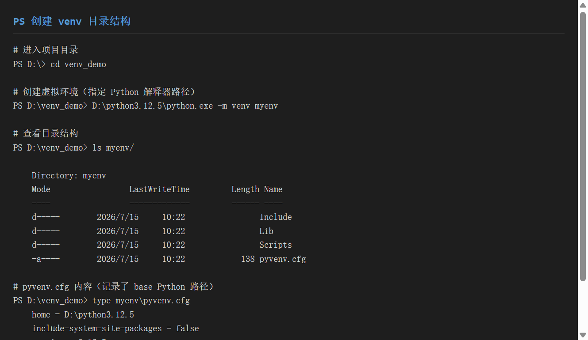
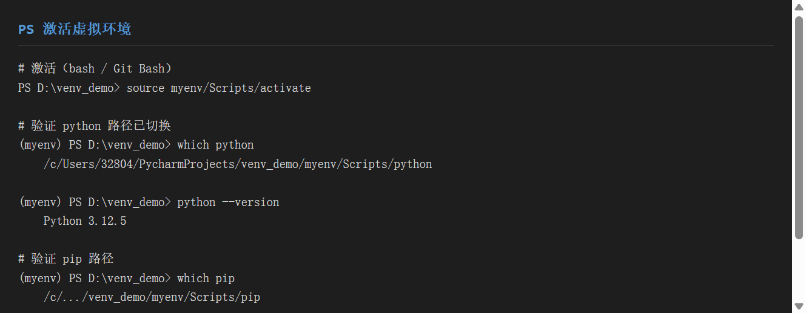
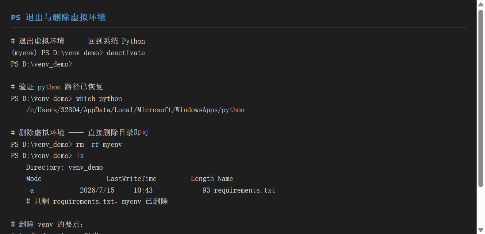
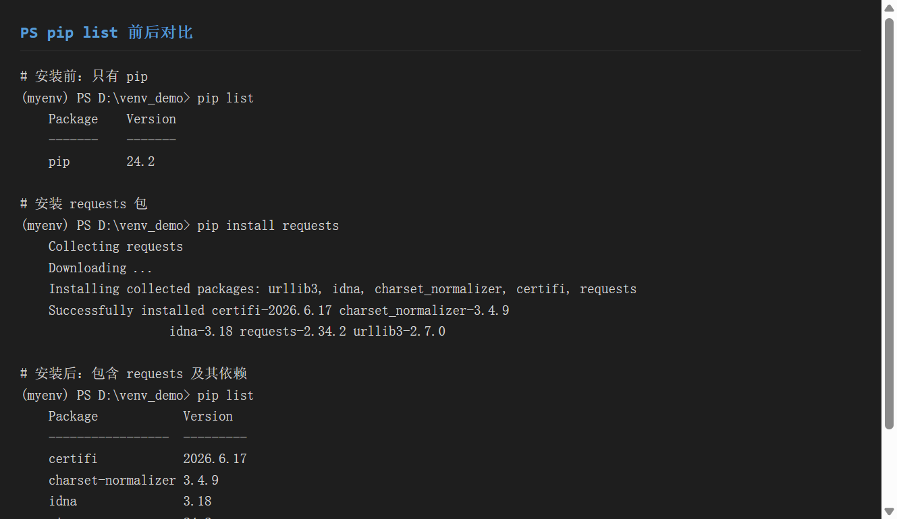
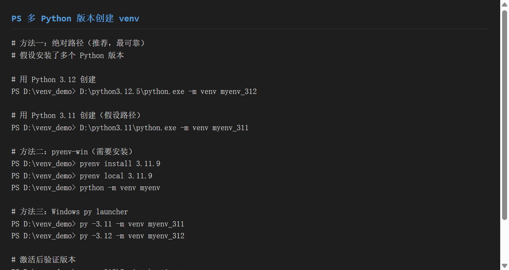
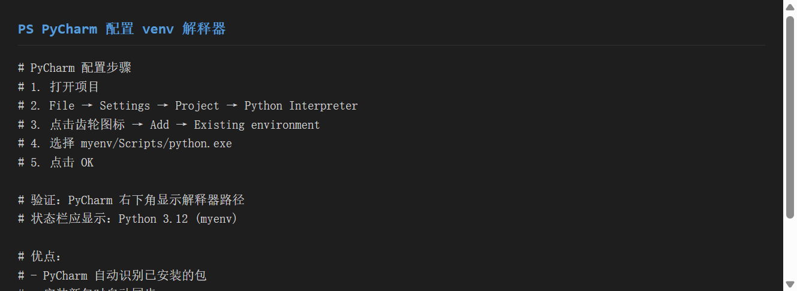

# 《venv 虚拟环境》使用分享

> 工具组合：**venv**（Python 官方虚拟环境）+ **pyenv-win**（多版本管理）
> 适用系统：Windows（本文命令均在 Windows 终端 / Git Bash 验证）
> 目标：一份文档教会你**隔离项目依赖、随心切换 Python 版本、对接 IDE**

---

## 一、环境准备

### 1.1 版本要求

| 工具 | 最低版本 | 说明 |
|------|---------|------|
| Python | **3.3+** | `venv` 从 3.3 起内置，无需额外安装 |
| 推荐版本 | 3.12.x | 本教程基于 3.12.5 演示 |
| pyenv-win | 3.x | 仅做多版本切换时才需要 |

> **关键认知**：`venv` 是 Python 标准库的一部分——**只要你装了 Python ≥ 3.3，就已经有了 `venv`**，不需要 `pip install`。

### 1.2 验证 venv 已就绪

```bash
# bash / Git Bash
python -m venv --help

# Windows PowerShell / CMD
python -m venv --help
```


> ▲ 截图标注：运行 `python -m venv --help` 后出现帮助信息，证明 venv 模块可用（红框标出帮助文本首行）。

### 1.3 pyenv-win 安装（可选，用于多版本）

```bash
# 方式一：Git 克隆（推荐）
git clone https://github.com/pyenv-win/pyenv-win.git ~/.pyenv

# 方式二：PowerShell 一键安装
Invoke-WebRequest -UseBasicParsing -Uri "https://raw.githubusercontent.com/pyenv-win/pyenv-win/master/pyenv-win/install-pyenv-win.ps1" -OutFile "./install-pyenv-win.ps1"; &"./install-pyenv-win.ps1"
```

安装后把 `pyenv-win\bin` 和 `pyenv-win\shims` 加入系统 PATH，验证：

```bash
pyenv --version
# pyenv 3.1.1
```

---

## 二、核心功能演示

### 2.1 功能一：创建虚拟环境

**目标**：为项目 `venv_demo` 创建一个干净的 Python 运行环境 `myenv`。

**步骤 1 — 进入项目目录**

```bash
cd D:\venv_demo
```

**步骤 2 — 创建 venv**

```bash
# 语法：python -m venv <环境目录名>
D:\python3.12.5\python.exe -m venv myenv
```

**步骤 3 — 查看生成的结构**

```bash
ls myenv/
# Include/   Lib/   Scripts/   pyvenv.cfg
```


> ▲ 截图标注：红框标出 `Include`、`Lib`、`Scripts` 三个核心子目录和 `pyvenv.cfg` 配置文件。

**步骤 4 — 理解 venv 的构成**

| 目录/文件 | 作用 |
|-----------|------|
| `Scripts/` | 独立的 `python.exe`、`pip.exe`、激活脚本 |
| `Lib/site-packages/` | 该环境专属的第三方包存放处 |
| `Include/` | C 扩展头文件 |
| `pyvenv.cfg` | 记录 base Python 路径、版本、是否继承系统包 |

`pyvenv.cfg` 内容示例：

```ini
home = D:\python3.12.5
include-system-site-packages = false   # false = 不继承系统全局包
version = 3.12.5
```

### 2.2 功能二：激活虚拟环境

**目标**：让终端里的 `python` / `pip` 命令指向 `myenv` 内部。

```bash
# bash / Git Bash
source myenv/Scripts/activate

# Windows PowerShell
myenv\Scripts\Activate.ps1

# Windows CMD
myenv\Scripts\activate.bat
```

激活后，提示符前面会出现环境名 `(myenv)`：

```bash
(myenv) PS D:\venv_demo>
```

**验证：python 路径已切换**

```bash
(myenv) PS D:\venv_demo> which python
/c/.../venv_demo/myenv/Scripts/python

(myenv) PS D:\venv_demo> python --version
Python 3.12.5
```


> ▲ 截图标注：红框标出 `which python` 输出中的 `myenv/Scripts/python` 路径，证明已进入隔离环境。

### 2.3 功能三：退出虚拟环境

```bash
# 任意 shell 通用
deactivate
```

退出后提示符前缀 `(myenv)` 消失，`python` 回到系统解释器：

```bash
PS D:\venv_demo> which python
/c/Users/32804/AppData/Local/Microsoft/WindowsApps/python
```

### 2.4 功能四：删除虚拟环境

venv 是**纯目录**，删除=直接删文件夹：

```bash
# 先退出
deactivate

# 再删除目录（bash）
rm -rf myenv

# 或 PowerShell
Remove-Item -Recurse -Force myenv
```


> ▲ 截图标注：红框标出 `deactivate` 命令执行后提示符前缀消失，以及 `rm -rf myenv` 后 `ls` 仅剩 `requirements.txt`。

> **删除要点**：① 先 `deactivate` ② 直接删目录即可，无注册表/配置残留 ③ 随时用相同命令重建。

### 2.5 功能五：包管理（pip）

激活环境后，所有 `pip` 操作只影响 `myenv`，**不会污染系统 Python**。

**① 查看已装包**

```bash
(myenv) PS D:\venv_demo> pip list
Package    Version
-------    -------
pip        24.2
```

**② 安装包**

```bash
(myenv) PS D:\venv_demo> pip install requests
Collecting requests
Downloading requests-2.34.2-py3-none-any.whl (63 kB)
Installing collected packages: urllib3, idna, charset_normalizer, certifi, requests
Successfully installed certifi-2026.6.17 charset-normalizer-3.4.9 idna-3.18 requests-2.34.2 urllib3-2.7.0
```

**③ 安装后再次查看**

```bash
(myenv) PS D:\venv_demo> pip list
Package            Version
------------------ ---------
certifi            2026.6.17
charset-normalizer 3.4.9
idna               3.18
pip                24.2
requests           2.34.2
urllib3            2.7.0
```


> ▲ 截图标注：红框标出安装前（仅 pip）与安装后（多出 requests 及其 4 个依赖）的列表差异。

**④ 导出依赖清单**

```bash
(myenv) PS D:\venv_demo> pip freeze > requirements.txt
```

**⑤ 从清单恢复（团队协作 / 部署）**

```bash
(myenv) PS D:\venv_demo> pip install -r requirements.txt
```

**⑥ 卸载包**

```bash
(myenv) PS D:\venv_demo> pip uninstall -y requests
```

### 2.6 功能六：多 Python 版本切换

当机器上装了多个 Python（如 3.11 和 3.12），有三种方式创建对应版本的 venv：

**方法 A — 绝对路径（最可靠，推荐）**

```bash
# 用 3.12 创建
D:\python3.12.5\python.exe -m venv myenv_312

# 用 3.11 创建（假设安装路径）
D:\python3.11\python.exe -m venv myenv_311
```

**方法 B — pyenv-win**

```bash
# 安装指定版本
pyenv install 3.11.9

# 在当前目录锁定版本
pyenv local 3.11.9

# 再创建 venv（此时 python 指向 3.11.9）
python -m venv myenv
```

**方法 C — Windows py launcher（系统自带）**

```bash
py -3.11 -m venv myenv_311
py -3.12 -m venv myenv_312
```


> ▲ 截图标注：红框标出三种方式的版本指定语法（`绝对路径` / `pyenv local` / `py -3.x`）。

**激活后验证版本**：

```bash
myenv_312\Scripts\activate
(myenv_312) PS D:\venv_demo> python --version
Python 3.12.5
```

### 2.7 功能七：IDE 配置（PyCharm）

**目标**：让 PyCharm 用上 `myenv` 作为项目解释器，获得正确的代码补全和包管理。

**步骤**：

1. 打开项目 → `File` → `Settings` → `Project: xxx` → `Python Interpreter`
2. 点击右上角**齿轮图标** → `Add...`
3. 选 `Existing environment`（已存在环境）
4. `Interpreter` 路径填：`D:\venv_demo\myenv\Scripts\python.exe`
5. 点 `OK` 确认

配置完成后：

- 右下角状态栏显示：`Python 3.12 (myenv)`
- `Python Interpreter` 列表里能看到 `requests` 等已装包
- 在 PyCharm 内置 Terminal 里会自动激活 venv


> ▲ 截图标注：红框标出 `Python Interpreter` 设置页中的 `Interpreter path` 输入框，以及填入的 `myenv\Scripts\python.exe` 路径。

---

## 三、实战示例

### 3.1 项目背景

假设你要开发一个**网络爬虫小工具**，需要：
- 独立的 `requests` 依赖（不想污染全局）
- 锁定 Python 3.12
- 交付时让同事一键复现环境

### 3.2 完整操作流程

```bash
# ① 建项目目录
mkdir crawler && cd crawler

# ② 用 Python 3.12 建虚拟环境
D:\python3.12.5\python.exe -m venv .venv

# ③ 激活
source .venv/Scripts/activate

# ④ 装依赖
pip install requests beautifulsoup4

# ⑤ 写代码（main.py）
# import requests ...

# ⑥ 导出依赖清单（提交到 Git）
pip freeze > requirements.txt

# ⑦ 验证：新同事克隆后只需
python -m venv .venv
source .venv/Scripts/activate
pip install -r requirements.txt
```

### 3.3 目录结构（最终结果）

```
crawler/
├── .venv/              # 虚拟环境（建议加入 .gitignore）
├── main.py             # 业务代码
├── requirements.txt    # 依赖清单（提交到 Git）
└── .gitignore          # 忽略 .venv/
```

**`.gitignore` 关键行**：

```gitignore
# 忽略虚拟环境目录
.venv/
venv/
myenv/
```

> 截图参考本章的各步骤截图（step01~step04）即可组合出完整流程展示。

---

## 四、踩坑记录

### 4.1 激活脚本执行被 PowerShell 策略拦截

**现象**：

```text
File C:\...\myenv\Scripts\Activate.ps1 cannot be loaded because running
scripts is disabled on this system.
```

**原因**：Windows PowerShell 默认禁止运行 `.ps1` 脚本（执行策略 `Restricted`）。

**解决**：

```bash
# 允许当前用户运行本地脚本（推荐）
Set-ExecutionPolicy -Scope CurrentUser RemoteSigned
```

或改用 bash：`source myenv/Scripts/activate`（不受影响）。

### 4.2 `pip install` 装到了全局而非 venv

**现象**：`pip list` 在 venv 里看不到刚装的包，系统 Python 里却有。

**原因**：激活失败或忘了激活，直接用了系统 `pip`。

**解决**：激活后先用 `which python` / `which pip` 确认路径含 `myenv`；不确定时改用绝对路径：

```bash
myenv/Scripts/pip install requests
```

### 4.3 VSCode / PyCharm 仍用系统 Python

**现象**：IDE 运行代码时报 `ModuleNotFoundError`，但终端 `pip list` 里有这个包。

**原因**：IDE 的解释器没切到 venv，用的是全局。

**解决**：在 IDE 里手动选择 `myenv/Scripts/python.exe` 作为解释器（见 2.7 节），并重启终端。

### 4.4 把 `.venv` 提交到了 Git

**现象**：仓库体积暴增几百 MB，CI 拉取极慢。

**解决**：

```bash
# 立即删除并提交 .gitignore
echo ".venv/" >> .gitignore
git rm -r --cached .venv
git add .gitignore
git commit -m "chore: ignore venv, use requirements.txt"
```

记住：**venv 永远不提交，只提交 `requirements.txt`**。

### 4.5 跨机器迁移 venv 失败

**现象**：把 `myenv` 压缩发给同事，解压后 `python` 启动报错。

**原因**：venv 内部记录的是**绝对路径**，换机器路径变了就失效。

**解决**：venv **不可移植**。正确做法是只传 `requirements.txt`，对方自己 `python -m venv` + `pip install -r`。

### 4.6 pyenv 切换后 venv 版本不对

**现象**：`pyenv local 3.11.9` 后建 venv，激活却显示 3.12。

**原因**：pyenv 的 shims 未生效，或 `python` 仍指向系统 launcher。

**解决**：确保 pyenv 的 `bin` 和 `shims` 在 PATH **最前面**；切换后用 `python --version` 确认，再建 venv。

---

## 五、总结

### 5.1 venv 优缺点

| 优点 | 缺点 |
|------|------|
| Python 内置，零安装 | 不支持跨平台复制（靠绝对路径） |
| 隔离彻底，不污染全局 | 多版本切换需配合 pyenv/绝对路径 |
| 激活简单，IDE 易对接 | 无依赖解析冲突自动解决（靠 pip） |
| 删除=删目录，干净 | —— |

### 5.2 pyenv 优缺点

| 优点 | 缺点 |
|------|------|
| 一键安装/切换多版本 | Windows 需 pyenv-win，配置略繁琐 |
| `pyenv local` 按项目锁定版本 | 与系统 launcher 易冲突（需调 PATH） |
| 不污染系统 Python | 首次下载编译较慢 |

### 5.3 适用场景

| 场景 | 推荐方案 |
|------|---------|
| 单个项目依赖隔离 | `venv` 足矣 |
| 一台机器维护多个 Python 版本 | `venv` + `pyenv-win` |
| 团队交付 / CI 部署 | `venv` + `requirements.txt` |
| 快速验证不同版本兼容性 | `py -3.x -m venv` 或 `pyenv local` |

### 5.4 一句话口诀

> **建环境 → `python -m venv 名` → `activate` 激活 → `pip` 装包 → `freeze` 导出 → 用完 `deactivate` → 删即 `rm -rf`**

---

## 附：速查表

```bash
# 创建
python -m venv myenv

# 激活（bash）
source myenv/Scripts/activate

# 激活（PowerShell）
myenv\Scripts\Activate.ps1

# 退出
deactivate

# 装包 / 导出 / 恢复
pip install requests
pip freeze > requirements.txt
pip install -r requirements.txt

# 删除
rm -rf myenv

# 多版本（绝对路径）
D:\python3.11\python.exe -m venv myenv_311
```
